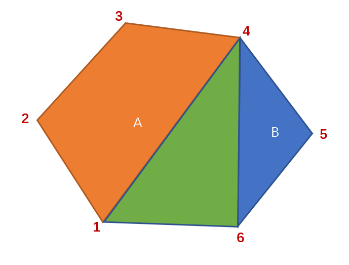
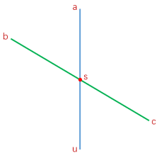
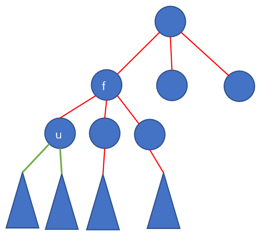

# 算法提高课

## 动态规划

### 数字三角形模型

#### [摘花生](https://www.acwing.com/problem/content/1017/)

大概题意: 方格图，每个交叉点上有一些花生，求从左上角$(1, 1)$开始，每步只能向右或者向下走，最终走到右下角$(m, n)$时能获得的最多花生数量


$$
\text{}
\begin{cases}
\text{状态表示$f[i, j]$}
    \begin{cases}
    \text{集合:所有从$(1,1)$走到$(i,j)$的路线}\\
    \text{属性:$Max$}
    \end{cases}\\
\text{状态计算(依据最后一步划分)}
    \begin{cases}
    \text{从上方走过来:$f[i-1,j]+w[i,j]$}\\
    \text{从左边走过来:$f[i,j-1]+w[i,j]$}
    \end{cases}
\end{cases}
$$

集合的划分要做到不重不漏，但是在求解$Min/Max$时是可以重复的，而在求解数量时则是必须的

最后得到转移方程如下:

$$
f[i,j]=max(f[i-1,j],f[i,j-1])
$$

代码如下:

```cpp
#include <iostream>

using namespace std;

const int M = 110, N = 110;
int w[M][N];
int f[M][N];
int K;
int m, n;

int main() {
    scanf("%d", &K);
    
    while (K--) {
        scanf("%d%d", &m, &n);
        for (int i = 1; i <= m; i++) {
            for (int j = 1; j <= n; j++) {
                scanf("%d", &w[i][j]);
            }
        }
        
        // 这里如果是从边界走过来的，因为边界初始化f[i][j]=0，所以肯定不如从真正的格子走过来采的花生多
        for (int i = 1; i <= m; i++) {
            for (int j = 1; j <= n; j++) {
                f[i][j] = max(f[i - 1][j], f[i][j - 1]) + w[i][j];
            }
        }
        
        printf("%d\n", f[m][n]); 
    }
    
    return 0;
}
```

#### [最低通行费](https://www.acwing.com/problem/content/1020/)

大致题意: $N\times N$大小方格图，穿越每个方格需要缴纳一定费用，以及花费$1$单位时间，一个人从左上角$(1,1)$进入方格(这步也要花费费用和时间)，每步可以上下左右走，不能走出方格，要求在$2N-1$的时间内从右下角$(N,N)$走出方格，问花费的最少费用

基本分析: 不走回头路(不向左或者上走)也需要$2N-1$的时间，因此只能向右下走

$$
\text{}
\begin{cases}
\text{状态表示$f[i, j]$}
    \begin{cases}
    \text{集合:所有从$(1,1)$走到$(i,j)$的路线}\\
    \text{属性:$Min$}
    \end{cases}\\
\text{状态计算(依据最后一步划分)}
    \begin{cases}
    \text{从上方走过来:$f[i-1,j]+w[i,j]$}\\
    \text{从左边走过来:$f[i,j-1]+w[i,j]$}
    \end{cases}
\end{cases}
$$

转移方程如下:

$$
f[i,j]=min(f[i,j-1], f[i-1,j])+w[i,j]
$$

代码:

```cpp
#include <iostream>

using namespace std;

const int N = 110, INF = 0x3f3f3f3f;
int w[N][N];
int f[N][N];
int n;

int main() {
    scanf("%d", &n);
    for (int i = 1; i <= n; i++) {
        for (int j = 1; j <= n; j++) {
            scanf("%d", &w[i][j]);
        }
    }
    
    for (int i = 1; i <= n; i++) {
        for (int j = 1; j <= n; j++) {
            // 左上角初始化为权值
            if (i == 1 && j == 1)   f[i][j] = w[i][j];
            else {
                // 其它方格初始化为正无穷
                f[i][j] = INF;
                if (i > 1)  f[i][j] = min(f[i][j], f[i - 1][j] + w[i][j]);
                if (j > 1)  f[i][j] = min(f[i][j], f[i][j - 1] + w[i][j]);
            }
        }
    }
    
    printf("%d", f[n][n]);
    
    return 0;
}
```

也可以将$f$数组初始化为正无穷，然后特判左上角

#### [方格取数](https://www.acwing.com/problem/content/1029/)

大致题意：方格图，每个格子上要么是正整数，要么是$0$，从左上角走到右下角，路径中可以将格子上的数字取出(取完变成$0$)，问从左上角到右下角走两次能够取得的最大数字和

**状态表示**: $f[i1, j1, i2, j2]$表示两条路径均从$(1,1)$开始走分别走到$(i1,j1)$和$(i2,j2)$的最大数字和

当且仅当$i1+j1=i2+j2$时，两条路径最后可能是重合的，即$i1=i2$时重合，$i1\ne i2$时不重合。可以将状态表示为$f[k, i1, i2]$，其中$k=i1+j1=i2+j2$，由于两条路径是同时走的，且只能向右或者向下，所以两条路径终点和起点的曼哈顿距离是相同的，也就是$k$

**状态计算**: 依旧可以考虑最后一步是怎么走的，只是有两条路径，一共是$2\times 2=4$种情况

1. 路径$1$最后一步向**右**走，路径$2$最后一步向**右**走
2. 路径$1$最后一步向**右**走，路径$2$最后一步向**下**走
3. 路径$1$最后一步向**下**走，路径$2$最后一步向**右**走
4. 路径$1$最后一步向**下**走，路径$2$最后一步向**下**走

不妨考虑一下情况1，两条路径分别为:
$$
Path1:(1, 1)\rightarrow \cdots\rightarrow(i1,j1-1)\rightarrow(i1,j1)\\
Path2:(1, 1)\rightarrow \cdots\rightarrow(i2,j2-1)\rightarrow(i2,j2)
$$

注意到最后一步前，两条路径为均从$(1,1)$开始分别走到$(i1,j1-1)$和$(i2,j2-1)$的路径，该集合取得数字和的最大值可以表示为$f[k-1,i1,i2]$，现在考虑最后一个格子，若$i1=i2$即两路径最后是重合的，那么只能加一次$w[i1,j1]$，否则需要加上$w[i1,j1]$和$w[i2,j2]$

既由情况1得到的转移方程为:
$$
f[k,i1,i2]=
\begin{cases}
f[k-1,i1,i2]+w[i1,j1],&i1=i2\\
f[k-1,i1,i2]+w[i1,j1]+w[i2,j2],&i1\ne i2
\end{cases}
$$

同理可得其他$3$种情况的转移方程:

**情况2:(右，下)**
$$
f[k,i1,i2]=
\begin{cases}
f[k-1,i1,i2-1]+w[i1,j1],&i1=i2\\
f[k-1,i1,i2-1]+w[i1,j1]+w[i2,j2],&i1\ne i2
\end{cases}
$$

**情况3:(下，右)**
$$
f[k,i1,i2]=
\begin{cases}
f[k-1,i1-1,i2]+w[i1,j1],&i1=i2\\
f[k-1,i1-1,i2]+w[i1,j1]+w[i2,j2],&i1\ne i2
\end{cases}
$$

**情况4:(下，下)**
$$
f[k,i1,i2]=
\begin{cases}
f[k-1,i1-1,i2-1]+w[i1,j1],&i1=i2\\
f[k-1,i1-1,i2-1]+w[i1,j1]+w[i2,j2],&i1\ne i2
\end{cases}
$$

总结得到下面的转移方程:
$$
f[k,i1,i2]=\\\max\{f[k-1,i1,i2],f[k-1,i1,i2-1],f[k-1,i1-1,i2],f[k-1,i1-1,i2-1]\}+w[i1,j1]+(i1==i2)\times w[i2,j2]
$$

代码:

```cpp
#include <iostream>
#include <algorithm>

using namespace std;

const int N = 20;
int w[N][N];
int f[2*N][N][N] = {0};
int n;

int main() {
    scanf("%d", &n);
    int a, b, c;
    while (scanf("%d%d%d", &a, &b, &c), a || b || c) w[a][b] = c;
    f[2][1][1] = w[1][1];
    
    for (int k = 3; k <= n + n; k++) {
        for (int i1 = 1; i1 <= n; i1++) {
            for (int i2 = 1; i2 <= n; i2++) {
                int j1 = k - i1, j2 = k - i2;
                if (j1 && j1 <= n && j2 && j2 <= n) {
                    int t = w[i1][j1];
                    if (i1 != i2)   t += w[i2][j2];
                    int &x = f[k][i1][i2];
                    x = max(x, f[k - 1][i1][i2]);
                    x = max(x, f[k - 1][i1 - 1][i2]);
                    x = max(x, f[k - 1][i1][i2 - 1]);
                    x = max(x, f[k - 1][i1 - 1][i2 - 1]);
                    x += t;
                }
            }
        }  
    }
    
    printf("%d", f[2*n][n][n]);
    
    return 0;
}
```

### 最长上升子序列模型

#### [最长上升子序列](https://www.acwing.com/problem/content/897/)

大致题意: 给一个长度为$N$的数组，求严格单调递增的子序列的最大长度

$$
\text{}
\begin{cases}
\text{状态表示$f[i]$}
    \begin{cases}
    \text{集合:所有以$nums[i]$为尾的严格单调上升子序列}\\
    \text{属性:$Max$}
    \end{cases}\\
\text{状态计算(依据倒数第二个数划分)}
    \begin{cases}
    \text{只有$nums[i]$一个数，$f[i] = 1$}\\
    \text{倒数第二个数是$nums[1]$，若$nums[1]<nums[i], f[i]=f[1]+1$}\\
    \text{倒数第二个数是$nums[2]$，若$nums[2]<nums[i], f[i]=f[2]+1$}\\
    \text{$\cdots$}\\
    \text{倒数第二个数是$nums[i-1]$，若$nums[i-1]<nums[i], f[i]=f[i-1]+1$}
    \end{cases}
\end{cases}
$$

可以得到如下转移方程:

$$
f[i]=\max\{f[j]\}, \forall 1\le j < i \&\& nums[j] < nums[i]
$$

代码:

```cpp
#include <iostream>

using namespace std;

const int N = 1010;
int a[N];
int f[N];
int n;

int main() {
    scanf("%d", &n);
    for (int i = 1; i <= n; i++)    scanf("%d", &a[i]);
    
    int res = 1;
    for (int i = 1; i <= n; i++) {
        f[i] = 1;
        for (int j = 1; j < i; j++) {
            if (a[j] < a[i])  f[i] = max(f[i], f[j] + 1);
        }
        res = max(res, f[i]);
    }
    
    printf("%d", res);
    
    return 0;
}
```

#### [怪盗基德的滑翔翼](https://www.acwing.com/problem/content/1019/)

大致题意: 若干不同高度的楼房，怪盗基德可以从某个楼房开始，初始选定一个方向(向左或向右)，然后只能跳向高度比当前楼房低的楼，问怪盗基德最多能够跳到多少个楼

分析: 确定完起点$a[i]$和方向后，相当于求解以$a[i]$为终点的最长上升子序列，因此只需要分别求解从左到右和从右到左的最长上升子序列即可

代码:

```cpp
#include <iostream>

using namespace std;

const int N = 110;
int a[N];
int f[N];
int n;
int K;

int main() {
    scanf("%d", &K);
    
    while (K--) {
        scanf("%d", &n);
        for (int i = 1; i <= n; i++)    scanf("%d", &a[i]);
        
        int res = 0;
        // 正向
        for (int i = 1; i <= n; i++) {
            f[i] = 1;
            for (int j = 1; j < i; j++)
                if (a[j] < a[i])    f[i] = max(f[i], f[j] + 1);
            res = max(res, f[i]);
        }
        // 反向
        for (int i = n; i >= 1; i--) {
            f[i] = 1;
            for (int j = n; j > i; j--)
                if (a[j] < a[i])    f[i] = max(f[i], f[j] + 1);
            res = max(res, f[i]);
        }
        
        printf("%d\n", res);
    }
    
    return 0;
}
```

#### [登山](https://www.acwing.com/problem/content/1016/)

大致题意: 给一个数组，按照下标递增顺序选择数，且一旦当前选择的数比前一个数小，那么以后选的数都要递减，问最多能选择多少个数；

分析: 选择的数中会有一个数成为山峰，即要求先增后减(也可能完全单调)的最长子序列，那么可以枚举山峰$a[i]$，求从左往右以$nums[i]$为尾的最长上升子序列长度以及从右往左以$nums[i]$为尾的最长上升子序列长度的和$h[i]$，那么最终结果为所有$h[i]$的最大值

代码:

```cpp
#include <iostream>

using namespace std;

const int N = 1010;
int a[N];
int f[N], g[N];
int n;

int main() {
    scanf("%d", &n);
    
    for (int i = 1; i <= n; i++)    scanf("%d", &a[i]);
    
    int res = 0;
    for (int i = 1; i <= n; i++) {
        f[i] = 1;
        for (int j = 1; j < i; j++)
            if (a[j] < a[i])    f[i] = max(f[i], f[j] + 1);
    }
    for (int i = n; i >= 1; i--) {
        g[i] = 1;
        for (int j = n; j > i; j--)
            if (a[j] < a[i])    g[i] = max(g[i], g[j] + 1);
        res = max(res, f[i] + g[i] - 1);
    }
    
    printf("%d", res);
    
    return 0;
}
```

#### [合唱队形](https://www.acwing.com/problem/content/484/)

大致题意: $N$个同学站成一排，要求其中$(N-K)$位同学出列，让剩下的$K$名同学身高按照先上升后下降(也可能单调递增或单调递减)排列，问最少需要多少名同学出列

分析: 本题和上一题登山类似，只是本题求的是最少需要多少名同学出列，可以转换为最多可以由多少名同学构成(先增后降)的队形，那就和上题一样

代码:

```cpp
#include <iostream>

using namespace std;

const int N = 110;
int a[N];
int f[N], g[N];
int n;

int main() {
    scanf("%d", &n);
    for (int i = 1; i <= n; i++)    scanf("%d", &a[i]);
    
    int res = 0;
    for (int i = 1; i <= n; i++) {
        f[i] = 1;
        for (int j = 1; j < i; j++)
            if (a[j] < a[i])    f[i] = max(f[i], f[j] + 1);
    }
    for (int i = n; i >= 1; i--) {
        g[i] = 1;
        for (int j = n; j > i; j--)
            if (a[j] < a[i])    g[i] = max(g[i], g[j] + 1);
        res = max(res, f[i] + g[i] - 1);
    }
    
    printf("%d", n - res);
    
    return 0;
}
```

#### [友好城市](https://www.acwing.com/problem/content/1014/)

大致题意: 南北方向各有$N$座城市，南方每座城市均有一个对应的北方友好城市，选择其中若干对友好城市，为其中每一对友好城市建桥，要求桥与桥之间不能交叉，问最多可以选择多少对友好城市

分析: 选择的这若干对友好城市如果排好序的话，那么南方城市是坐标递增的，对应的北方城市也是坐标递增的。因此可以先将南方城市按坐标排序，然后得到一个对应的北方城市序列，求解这个序列的最长上升子序列

代码:

```cpp
#include <iostream>
#include <algorithm>

using namespace std;

const int N = 5010;
typedef pair<int, int> pii;
pii a[N];
int f[N];
int n;

int main() {
    scanf("%d", &n);
    for (int i = 1; i <= n; i++) {
        int x, y;
        scanf("%d%d", &x, &y);
        a[i] = {x, y};
    }
    // 南方城市按升序排序
    sort(a + 1, a + 1 + n);
    int res = 0;
    // 求解对应北方城市序列的最长上升子序列
    for (int i = 1; i <= n; i++) {
        f[i] = 1;
        for (int j = 1; j < i; j++) 
            if (a[j].second < a[i].second)  f[i] = max(f[i], f[j] + 1);
        res = max(res, f[i]);
    }
    
    printf("%d", res);
    
    return 0;
}
```

#### [最大上升子序列和](https://www.acwing.com/problem/content/1018/)

$$
\text{}
\begin{cases}
\text{状态表示$f[i]$}
    \begin{cases}
    \text{集合:所有以$nums[i]$为尾的严格单调上升子序列}\\
    \text{属性:$Max$,和的最大值}
    \end{cases}\\
\text{状态计算(依据倒数第二个数划分)}
    \begin{cases}
    \text{只有$nums[i]$一个数，$f[i] = nums[i]$}\\
    \text{倒数第二个数是$nums[1]$，若$nums[1]<nums[i], f[i]=f[1]+nums[i]$}\\
    \text{倒数第二个数是$nums[2]$，若$nums[2]<nums[i], f[i]=f[2]+nums[i]$}\\
    \text{$\cdots$}\\
    \text{倒数第二个数是$nums[i-1]$，若$nums[i-1]<nums[i], f[i]=f[i-1]+nums[i]$}
    \end{cases}
\end{cases}
$$

代码:

```cpp
#include <iostream>

using namespace std;

const int N = 1010;
int a[N];
int f[N];
int n;

int main() {
    scanf("%d", &n);
    for (int i = 1; i <= n; i++)    scanf("%d", &a[i]);
    int res = 0;
    for (int i = 1; i <= n; i++) {
        f[i] = a[i];
        for (int j = 1; j < i; j++)
            if (a[j] < a[i])    f[i] = max(f[i], f[j] + a[i]);
        res = max(res, f[i]);
    }
    
    printf("%d", res);
    
    return 0;
}
```

#### [拦截导弹](https://www.acwing.com/problem/content/1012/)

大致题意: 给一个数组，求最长不上升子序列的长度，以及数组可以最少被划分成多少个不上升子序列

分析: 第一问可以参考$LIS$问题求解，第二问需要用到贪心算法，对于当前$a[i]$，可以将它接到某个序列结尾(空序列也可以看作一种序列)，那么满足条件的前提下，可以将它接在尾部最小的且满足尾部数字大于等于$a[i]$的序列

可以用**交换论证法(Exchange argument)** 来证明贪心算法的正确性

**交换论证法:**

- 给出贪心算法$A$的描述
- 假设$O$是和$A$最相似的(即前$k$个步骤都相同，第$k+1$个步骤不同)的最优解法
- 修改算法$O$，得到新的算法$O'$
- 证明$O'$是对的
- 证明$O'$至少和$O$是一样的，即$O'$也是最优的
- 得到矛盾，因为$O'$比$O$更和$A$相似

对于本题，到决定$a[i]$位置的时候，已经产生若干非上升子序列，对于贪心算法，可以找到一个序列$\cdots seq\cdots x$，其中$x$是所有序列中尾部数字满足大于等于$a[i]$的最小数，假设贪心做法不是最优解，那么必然可以找到一个和贪心解$A$最相近的最优解$O$，它在$a[i]$之前的选择都和贪心一样，但是在选择$a[i]$时，找到另一个序列$\cdots seq \cdots y$，然后将$a[i]$放在序列后，由此可以得到$y \ge x \ge a[i]$

对于解法$O$，其中两个序列为$\cdots seq1 \cdots x, a[j]\cdots seq2\cdots$和$\cdots seq3 \cdots y, a[i]\cdots seq4\cdots$，那么可以得到有$y \ge x \ge a[i], x \ge a[j]$，因此有$y \ge x \ge a[j], x \ge a[i]$，可以交换两个序列的后半部分得到解法$O'$，它的其它序列和$O$一样，只是之前两个序列变成了$\cdots seq1 \cdots x, a[i]\cdots seq4\cdots$和$\cdots seq3 \cdots y, a[j]\cdots seq2\cdots$，可以得到$O'$构造的序列是正确的且非上升子序列个数和$O$是一样的，但是$a[i]$的位置却和贪心解$A$的选择一样，即比起$O$，$O'$和$A$更相似，得出矛盾

可以选择用一个数组$g$来记录当前所有子序列的尾部数字，$g$是单调上升的，这一点可以用数学归纳法来证明，假设当前$g$为$\cdots a, x, y, b\cdots$，其中$x, y$对于当前$a[i]$有$a\lt x\lt a[i]\le y\lt b$，可以将$a[i]$接在末尾数字为$y$的序列后面，那么$g$变成了$\cdots a, x, a[i], b\cdots$，可以发现其任然满足单调上升的性质

代码:

```cpp
#include <iostream>

using namespace std;

const int N = 1010;
int a[N];
int f[N];
// g[i]记录第i个序列末尾数字，cnt记录当前有几个序列
int g[N], cnt;
int n;

int main() {
    while (cin >> a[n]) n++;
    
    // LIS求解第一问
    int lis = 0;
    for (int i = 0; i < n; i++) {
        f[i] = 1;
        for (int j = 0; j < i; j++)
            if (a[j] >= a[i])   f[i] = max(f[i], f[j] + 1);
        lis = max(lis, f[i]);
    }
    cout << lis << endl;
    
    // 贪心求解第二问
    for (int i = 0; i < n; i++) {
        int k = 0;
        while (k < cnt && g[k] < a[i])  k++;
        g[k] = a[i];
        if (k >= cnt)   cnt++;
    }
    cout << cnt << endl;
    
    return 0;
}
```

另外根据**Dilworth定理**可以得到**数组的最少非上升子序列划分数=数组的最长上升子序列长度**，即原来问题满足性质"$\ge$"，它的对偶问题满足性质"$\lt$"

同理可以得到如下结论:
**数组的最少上升子序列划分数=数组的最长非上升子序列长度**
**数组的最少下降子序列划分数=数组的最长非下降子序列长度**
**数组的最少非下降子序列划分数=数组的最长下降子序列长度**

那么可以根据$LIS$问题的贪心做法，见[最长上升子序列](https://www.acwing.com/activity/content/code/content/2241178/)，求解本题第二问

```cpp
#include <iostream>

using namespace std;

const int N = 1010;
int a[N];
int f[N];
// g[i]记录长度为i的子序列尾部数字的最大值，maxlen记录子序列的最大长度
int g[N], maxlen;
int n;

int main() {
    while (cin >> a[n]) n++;
    
    // LIS求解第一问
    int lis = 0;
    for (int i = 0; i < n; i++) {
        f[i] = 1;
        for (int j = 0; j < i; j++)
            if (a[j] >= a[i])   f[i] = max(f[i], f[j] + 1);
        lis = max(lis, f[i]);
    }
    cout << lis << endl;
    
    // 贪心求解第二问
    maxlen = 1, g[maxlen] = a[0];
    for (int i = 1; i < n; i++) {
        if (a[i] > g[maxlen])   g[++maxlen] = a[i];
        else {
            int l = 1, r = maxlen;
            while (l < r) {
                int mid = l + r >> 1;
                if (g[mid] < a[i])  l = mid + 1;
                else    r = mid;
            }
            g[r] = a[i];
        }
    }
    cout << maxlen << endl;
    
    return 0;
}
```

#### [导弹防御系统](https://www.acwing.com/problem/content/189/)

大致题意: 数组最少可以被多少个严格单调上升子序列和严格单调下降子序列覆盖

分析: 贪心只能求解上升/下降其中的一种问题，对于本题只能在外层套一层$dfs$，然后用上层的思路来做

代码:

```cpp
#include <iostream>

using namespace std;

const int N = 55;
int a[N];
// up是非单调上升的，down是非单调下降的
int up[N], down[N];
int n;
int ans;

// su-当前上升子序列个数，sd-当前下降子序列个数
void dfs(int u, int su, int sd) {
    // su + sd已经不可能变小了，剪枝
    if (su + sd >= ans) return;
    // 由于上面的剪枝，到这一步su + sd < ans是肯定的
    if (u == n) {
        ans = su + sd;
        return;
    }
    // 将当前数划分到上升子序列
    int k = 0;
    while (k < su && up[k] >= a[u]) k++;
    int t = up[k];
    up[k] = a[u];
    if (k >= su)    dfs(u + 1, su + 1, sd);
    else    dfs(u + 1, su, sd);
    up[k] = t;
    
    // 将当前数划分到下降子序列
    k = 0;
    while (k < sd && down[k] <= a[u])   k++;
    t = down[k];
    down[k] = a[u];
    if (k >= sd)    dfs(u + 1, su, sd + 1);
    else   dfs(u + 1, su, sd);
    down[k] = t;
}

int main() {
    while (cin >> n, n) {
        for (int i = 0; i < n; i++) cin >> a[i];
        ans = n;
        dfs(0, 0, 0);
        cout << ans << endl;
    }    
    
    return 0;
}
```

对于上面的**up是非单调上升的，down是非单调下降的**的证明，假设将当前$a[i]$加入序列前，$up$为$\cdots a, x, y, b \cdots$，其中$x, y$满足$a\ge x\ge a[i]\gt y\ge b$，即$y$是$up$所有序列尾数中满足小于$a[i]$的最大数，将$a[i]$加入这个序列尾部，即将$y$更新为$a[i]$，得到新的$up$为$\cdots a, x, a[i], b \cdots$，同样满足非单调上升性质，对于$down$是非单调下降的证明同理

另外可以用二分查找优化查找$y$，代码如下:

```cpp
#include <iostream>

using namespace std;

const int N = 55;
int a[N];
// up是非单调上升的，down是非单调下降的
int up[N], down[N];
int n;
int ans;

// su-当前上升子序列个数，sd-当前下降子序列个数
void dfs(int u, int su, int sd) {
    // su + sd已经不可能变小了，剪枝
    if (su + sd >= ans) return;
    // 由于上面的剪枝，到这一步su + sd < ans是肯定的
    if (u == n) {
        ans = su + sd;
        return;
    }
    // 将当前数划分到上升子序列
    int l = 0, r = su;
    while (l < r) {
        int mid = l + r >> 1;
        if (up[mid] >= a[u])    l = mid + 1;
        else    r = mid;
    }
    int t = up[r];
    up[r] = a[u];
    if (r == su)    dfs(u + 1, su + 1, sd);
    else    dfs(u + 1, su, sd);
    up[r] = t;
    
    // 将当前数划分到下降子序列
    l = 0, r = sd;
    while (l < r) {
        int mid = l + r >> 1;
        if (down[mid] <= a[u])    l = mid + 1;
        else    r = mid;
    }
    t = down[r];
    down[r] = a[u];
    if (r == sd)    dfs(u + 1, su, sd + 1);
    else    dfs(u + 1, su, sd);
    down[r] = t;
}

int main() {
    while (cin >> n, n) {
        for (int i = 0; i < n; i++) cin >> a[i];
        ans = n;
        dfs(0, 0, 0);
        cout << ans << endl;
    }    
    
    return 0;
}
```

#### [最长公共上升子序列](https://www.acwing.com/problem/content/274/)

**最长公共子序列:**

$$
\text{闫氏DP分析}
\begin{cases}
\text{状态表示$f[i,j]$}
    \begin{cases}
    \text{集合:所有以$a$的前$i$个字母，和以$b$的前$j$个字母构成的序列}\\
    \text{属性:$Max$}
    \end{cases}\\
\text{状态计算(依据$a[i]$和$b[j]$在不在序列中划分)}
    \begin{cases}
    \text{①$a[i],b[j]$都在}
        \begin{cases}
        \text{$a[i]=b[j],f[i,j]=f[i-1,j-1]+1$}\\
        \text{$a[i]\ne b[j],f[i,j]=0$}
        \end{cases}\\
    \text{②$a[i]$在,$b[j]$不在,$f[i,j]=f[i,j-1]$}\\
    \text{③$a[i]$不在,$b[j]$在,$f[i,j]=f[i-1,j]$}\\
    \text{④$a[i],b[j]$都不在,$f[i,j]=f[i-1,j-1]$}\\
    \end{cases}
\end{cases}
$$

转移方程如下:

$$
f[i,j]=max(f[i-1][j-1], f[i-1][j], f[i][j-1], f[i-1][j-1]+a[i] == b[j])
$$

由于$f[i-1][j-1]$所对应的集合被包含在$f[i-1][j]$的集合之中，而属性为最大值，集合可以重叠，所以可以改写为:

$$
f[i,j]=max(f[i-1][j], f[i][j-1], f[i-1][j-1]+a[i] == b[j])
$$

**最长上升子序列:**
$$
\text{}
\begin{cases}
\text{状态表示$f[i]$}
    \begin{cases}
    \text{集合:所有以$nums[i]$为尾的严格单调上升子序列}\\
    \text{属性:$Max$,和的最大值}
    \end{cases}\\
\text{状态计算(依据倒数第二个数划分)}
    \begin{cases}
    \text{只有$nums[i]$一个数，$f[i] = nums[i]$}\\
    \text{倒数第二个数是$nums[1]$，若$nums[1]<nums[i], f[i]=f[1]+nums[i]$}\\
    \text{倒数第二个数是$nums[2]$，若$nums[2]<nums[i], f[i]=f[2]+nums[i]$}\\
    \text{$\cdots$}\\
    \text{倒数第二个数是$nums[i-1]$，若$nums[i-1]<nums[i], f[i]=f[i-1]+nums[i]$}
    \end{cases}
\end{cases}
$$

**最长公共上升子序列:**
$$
\text{}
\begin{cases}
\text{状态表示$f[i,j]$}
    \begin{cases}
    \text{集合:所有以$a$的前$i$个数，和以$b$的前$j$个数构成的，且以$b[j]$结尾的公共上升子序列}\\
    \text{属性:$Max$}
    \end{cases}\\
\text{状态计算(依据$a[i]$在不在序列中划分)}
    \begin{cases}
    \text{$a[i]$不在序列中,$f[i,j]=f[i-1,j]$}\\
    \text{$a[i]$在序列中}
        \begin{cases}
        \text{$a[i]\ne b[j]$,$f[i,j]=0$}\\
        \text{$a[i]=b[j]$}
            \begin{cases}
            \text{只有$b[j]$一个数，$f[i,j]=1$}\\
            \text{倒数第二个数是$b[1]$，$f[i,j]=f[i-1,1]+1$}\\
            \text{$\cdots$}\\
            \text{倒数第二个数是$b[j-1]$，$f[i,j]=f[i-1,j-1]+1$}\\
            \end{cases}\\
        \end{cases}\\
    \end{cases}
\end{cases}
$$

得到转移方程为:

$$
f[i,j]=f[i-1,j],若a[i]=b[j],f[i,j]=max(f[i,j], max\{f[i-1,k]\}+1),1\le k\lt j\ \&\&b\ [k]<b[j]
$$

代码:

```cpp
#include <iostream>

using namespace std;

const int N = 3010;
int a[N], b[N];
int f[N][N];
int n;

int main() {
    cin >> n;
    for (int i = 1; i <= n; i++)    cin >> a[i];
    for (int i = 1; i <= n; i++)    cin >> b[i];
    
    int res = 0;
    for (int i = 1; i <= n; i++) {
        for (int j = 1; j <= n; j++) {
            // 不包含a[i]
            f[i][j] = f[i - 1][j];
            // 包含a[i]
            if (a[i] == b[j]) {
                // 只有b[j]一个数
                f[i][j] = max(f[i][j], 1);
                // 枚举倒数第二个数
                for (int k = 1; k < j; k++)
                    if (b[k] < b[j])    f[i][j] = max(f[i][j], f[i - 1][k] + 1);
            }
            res = max(res, f[i][j]);
        }
    }
    
    cout << res << endl;
    
    return 0;
}
```

上面的代码时间复杂度为$O(N^3)$，在$N=3000$的数据量下会$TLE$，所以需要考虑优化

考察下面这部分代码:

```cpp
for (int j = 1; j <= n; j++) {
    f[i][j] = f[i - 1][j];
    if (a[i] == b[j]) {
        f[i][j] = max(f[i][j], 1);
        for (int k = 1; k < j; k++)
            if (b[k] < b[j])    f[i][j] = max(f[i][j], f[i - 1][k] + 1);
    }
    res = max(res, f[i][j]);
}
```

因为$a[i]=b[j]$，可以将$b[k]<b[j]$改成$b[k]<a[i]$，得到:

```cpp
for (int j = 1; j <= n; j++) {
    f[i][j] = f[i - 1][j];
    if (a[i] == b[j]) {
        f[i][j] = max(f[i][j], 1);
        for (int k = 1; k < j; k++)
            if (b[k] < a[i])    f[i][j] = max(f[i][j], f[i - 1][k] + 1);
    }
    res = max(res, f[i][j]);
}
```

那可以考虑将下面这部优化进入第二层循环:

```cpp
for (int k = 1; k < j; k++)
    if (b[k] < a[i])    f[i][j] = max(f[i][j], f[i - 1][k] + 1);
```

最终得到:

```cpp
#include <iostream>

using namespace std;

const int N = 3010;
int a[N], b[N];
int f[N][N];
int n;

int main() {
    cin >> n;
    for (int i = 1; i <= n; i++)    cin >> a[i];
    for (int i = 1; i <= n; i++)    cin >> b[i];
    
    int res = 0;
    for (int i = 1; i <= n; i++) {
        // maxv等价于所有k满足k<j且b[k]<a[i]的最大f[i-1][k]+1
        // 初始maxv为1，即只有b[j]一个数的情况
        int maxv = 1;
        for (int j = 1; j <= n; j++) {
            // 不包含a[i]
            f[i][j] = f[i - 1][j];
            // 包含a[i]
            if (a[i] == b[j]) f[i][j] = max(f[i][j], maxv);
            // 更新maxv，下一次循环是j+1，所以f[i-1][j]+1也要考虑
            if (b[j] < a[i])    maxv = max(maxv, f[i - 1][j] + 1);
            res = max(res, f[i][j]);
        }
    }
    
    cout << res << endl;
    
    return 0;
}
```

### 背包模型

$$
\text{}
\begin{cases}
\text{01背包: 每个物品选/不选}\\
\text{完全背包: 每个物品可以选任意多个}\\
\text{多重背包: 每个物品有若干数量，可以在范围内选取任意多个}\\
\text{分组背包: 若干组物品，每组物品若干个，同一组物品最多只选一个}
\end{cases}
$$

#### [01背包问题](https://www.acwing.com/problem/content/2/)

$$
\text{}
\begin{cases}
\text{状态表示$f[i, j]$}
    \begin{cases}
    \text{集合:所有只从前$i$个物品中选，且总体积不超过$j$的选法集合}\\
    \text{属性:$Max$}
    \end{cases}\\
\text{状态计算(依据最后一步划分)}
    \begin{cases}
    \text{选择第$i$个物品,$f[i,j]=f[i-1,j-v[i]]+w[i]$}\\
    \text{不选择第$i$个物品,$f[i,j]=f[i-1,j]$}
    \end{cases}
\end{cases}
$$

故得到转移方程:
$$
f[i,j]=max(f[i-1,j-v[i]]+w[i],f[i-1,j])
$$
代码:

```cpp
#include <iostream>

using namespace std;

const int N = 1010, V = 1010;
int f[N][V];
int w[N], v[N];
int n, m;

int main() {
    cin >> n >> m;
    for (int i = 1; i <= n; i++)    cin >> v[i] >> w[i];
    
    for (int i = 1; i <= n; i++) {
        for (int j = 0; j <= m; j++) {
            // 不选择第i件物品
            f[i][j] = f[i - 1][j];
            // 选择第i件物品
            if (j >= v[i])  f[i][j] = max(f[i][j], f[i - 1][j - v[i]] + w[i]);
        }
    }
    
    cout << f[n][m] << endl;
    
    return 0;
}
```

可以使用滚动数组优化，降低空间复杂度，注意优化的准则为**代码等价**

```cpp
#include <iostream>

using namespace std;

const int N = 1010, V = 1010;
// int f[N][V];
int f[V];   // 首先将二维dp数组降为一维
int w[N], v[N];
int n, m;

int main() {
    cin >> n >> m;
    for (int i = 1; i <= n; i++)    cin >> v[i] >> w[i];
    
    // 初始f[j]表示的是f[0][j]
    // 即从前0个物品中选，应当为0，但全局变量默认为0，所以不用初始化
    
    for (int i = 1; i <= n; i++) {
        for (int j = m; j >= v[i]; j--) {
            // 下面这句话等价为f[j] = f[j]为恒等式，可以去掉
            // f[i][j] = f[i - 1][j];  
            
            // if (j >= v[i])  f[i][j] = max(f[i][j], f[i - 1][j - v[i]] + w[i]);
            f[j] = max(f[j], f[j - v[i]] + w[i]);
            // 改成一维后可以看一下是否等价
            // 上面这句还原二维后为 f[i][j] = max(f[i][j], f[i][j-v[i]]+w[i])
            // 和之前的不等价，需要将第二维继续，同时改范围去掉if
        }
    }
    
    cout << f[m] << endl;
    
    return 0;
}
```

#### [完全背包问题](https://www.acwing.com/problem/content/3/)

$$
\text{}
\begin{cases}
\text{状态表示$f[i, j]$}
    \begin{cases}
    \text{集合:所有只从前$i$个物品中选，且总体积不超过$j$的选法集合}\\
    \text{属性:$Max$}
    \end{cases}\\
\text{状态计算(依据最后一步划分)}
    \begin{cases}
    \text{不选择第$i$个物品,$f[i,j]=f[i-1,j]$}\\
    \text{第$i$个物品选择$1$个,$f[i,j]=f[i-1,j-v[i]]+w[i]$}\\
    \text{$\cdots$}\\
    \text{第$i$个物品选择$k$个,$f[i,j]=f[i-1,j-k*v[i]]+k*w[i]$}
    \end{cases}
\end{cases}
$$

上面的$k$指的是对于体积$j$来说，可以最多选取的$i$物品数量

因此得到转移方程:

$$
f[i,j]=\max\{f[i-1,j-t*v[i]]+t*w[i]\},0\le t\le k
$$

代码如下:

```cpp
#include <iostream>

using namespace std;

const int N = 1010, V = 1010;
int v[N], w[N];
int f[N][V];
int n, m;

int main() {
    cin >> n >> m;
    for (int i = 1; i <= n; i++)    cin >> v[i] >> w[i];
    
    for (int i = 1; i <= n; i++) {
        for (int j = 0; j <= m; j++) {
            for (int k = 0; k * v[i] <= j; k++) {
                f[i][j] = max(f[i][j], f[i - 1][j - k * v[i]] + k * w[i]);
            }
        }
    }
    
    cout << f[n][m] << endl;
    
    return 0;
}
```

上面做法时间复杂度为$O(N^3)$，会$TLE$

可以考虑优化第三重循环

$$
f[i,j]=max(f[i-1,j],f[i-1,j-v]+w,f[i-1,j-2v]+2w, \cdots,f[i-1,j-kv]+kw)\\
\quad f[i,j-v]=max(f[i-1,j-v],f[i-1,j-2v]+w, \cdots,f[i-1,j-kv]+(k-1)w)
$$

根据上面两个转移方程，可以优化$f[i,j]$的转移方程为:

$$
f[i,j]=max(f[i-1,j], f[i,j-v]+w)
$$

代码:

```cpp
#include <iostream>

using namespace std;

const int N = 1010, V = 1010;
int v[N], w[N];
int f[N][V];
int n, m;

int main() {
    cin >> n >> m;
    for (int i = 1; i <= n; i++)    cin >> v[i] >> w[i];
    
    for (int i = 1; i <= n; i++) {
        for (int j = 0; j <= m; j++) {
            f[i][j] = f[i - 1][j];
            if (j >= v[i])  f[i][j] = max(f[i][j], f[i][j - v[i]] + w[i]);
        }
    }
    
    cout << f[n][m] << endl;
    
    return 0;
}
```

使用滚动数组可以继续优化空间复杂度，同样按照代码等价的原则，代码如下:

```cpp
#include <iostream>

using namespace std;

const int N = 1010, V = 1010;
int v[N], w[N];
int f[V];
int n, m;

int main() {
    cin >> n >> m;
    for (int i = 1; i <= n; i++)    cin >> v[i] >> w[i];
    
    for (int i = 1; i <= n; i++) {
        for (int j = v[i]; j <= m; j++) {
            f[j] = max(f[j], f[j - v[i]] + w[i]);
        }
    }
    
    cout << f[m] << endl;
    
    return 0;
}
```
**当空间优化成一维时，循环顺序为:物品-体积-决策**
**当空间优化为一维时，只有完全背包第二层循环是升序的，其它背包问题全是降序**

#### [多重背包问题 I](https://www.acwing.com/problem/content/4/)

$$
\text{}
\begin{cases}
\text{状态表示$f[i, j]$}
    \begin{cases}
    \text{集合:所有只从前$i$个物品中选，且总体积不超过$j$的选法集合}\\
    \text{属性:$Max$}
    \end{cases}\\
\text{状态计算(依据最后一步划分)}
    \begin{cases}
    \text{不选择第$i$个物品,$f[i,j]=f[i-1,j]$}\\
    \text{第$i$个物品选择$1$个,$f[i,j]=f[i-1,j-v[i]]+w[i]$}\\
    \text{$\cdots$}\\
    \text{第$i$个物品选择$k$个,$f[i,j]=f[i-1,j-k*v[i]]+k*w[i]$}
    \end{cases}
\end{cases}
$$

上面的$k$指的是对于体积$j$来说，可以最多选取的$i$物品数量

因此得到转移方程:

$$
f[i,j]=\max\{f[i-1,j-t*v[i]]+t*w[i]\},0\le t\le k
$$

代码:

```cpp
#include <iostream>

using namespace std;

const int N = 110, V = 110;
int v[N], w[N], s[N];
int f[N][V];
int n, m;

int main() {
    cin >> n >> m;
    for (int i = 1; i <= n; i++)    cin >> v[i] >> w[i] >> s[i];
    
    for (int i = 1; i <= n; i++) {
        for (int j = 0; j <= m; j++) {
            for (int k = 0; k <= min(j / v[i], s[i]); k++) {
                f[i][j] = max(f[i][j], f[i - 1][j - k * v[i]] + k * w[i]);
            }
        }
    }
    
    cout << f[n][m] << endl;
    
    return 0;
}
```

#### [多重背包问题 II](https://www.acwing.com/problem/content/5/)

数据量增加到了$N=10^3$级别，$O(N^3)$的算法在此题不适用

那么是否可以用完全背包问题同样的方法来优化转移方程呢，答案是否定的

多重背包和完全背包的区别在于多重背包的物品数量不是无限的

假设物品数量是无限的，那么第$i$件物品最多可选$g=\lfloor \frac{j}{v}\rfloor$个

若$g\le s$，其中$s$为第$i$件物品的实际数量，则有$gv\le j\lt (g+1)v$可以得到

$$
f[i,j]=max(f[i-1,j],f[i-1,j-v]+w,f[i-1,j-2v]+2w,\cdots,f[i-1,j-gv]+gw)\\
f[i,j-v]=max(f[i-1,j-v],f[i-1,j-2v]+w,\cdots,f[i-1,j-gv]+(g-1)w)
$$

上面这种转移方程可以像完全背包一样优化

但是若$g\gt s$，其中$s$为第$i$件物品的实际数量，则有$sv\lt (s+1)v\le gv\le j$可以得到

$$
f[i,j]=max(f[i-1,j],f[i-1,j-v]+w,f[i-1,j-2v]+2w,\cdots,f[i-1,j-sv]+sw)\\
f[i,j-v]=max(f[i-1,j-v],f[i-1,j-2v]+w,\cdots,f[i-1,j-(s+1)v]+sw)
$$

这种情况就不能优化了，必须考虑其它方法

假设$s=2^0+2^1+\cdots+2^k+c$，其中$2^k\le c\lt 2^{k+1}$，即可以将$s$个物品$i$拆分成若干组，每组数量分别为$1,2,\cdots,2^k,c$个，对于**每组物品要么全选要么全不选**，那么可以将多重背包转换成$01$背包问题

能够这样转换的前提是两者是等价的，即这样取可以满足取到$\forall x\in[0,s]$个物品$i$，证明如下:

所有选取方法可以划分为两大类:选取/不选取数量为$c$的这组物品

当选取数量为$c$的这组物品时，其它组可选物品$i$的数量范围是$[0,s-c]$，加上这组$c$个物品，得到物品数量范围为$[c,s]$

当不选取数量为$c$的这组物品时，得到的物品数量范围是$[0,s-c]$

只要证明$[0,s-c]\cup [c,s]=[0,s]$即可，即证明$s-c\ge c$

由$2^k\le c\lt 2^{k+1}$可得，$s-c=\sum_{i=0}^k=2^{k+1}-1\ge c$，证毕

代码如下:

```cpp
#include <iostream>

using namespace std;

// s上限是2000，最多可以拆成11组，即物品数量是原来的11倍
const int N = 12000, V = 2010;
int v[N], w[N];
int f[V];
int n, m;

int main() {
    cin >> n >> m;
    // 拆分成01背包
    int cnt = 0;
    for (int i = 1; i <= n; i++) {
        int vi, wi, si;
        cin >> vi >> wi >> si;
        int t = 1;
        while (si >= t) {
            v[++cnt] = t * vi;
            w[cnt] = t * wi;
            si -= t, t *= 2;
        }
        if (si) v[++cnt] = si * vi, w[cnt] = si * wi;
    }
    
    
    for (int i = 1; i <= cnt; i++) {
        for (int j = m; j >= v[i]; j--) {
            f[j] = max(f[j], f[j - v[i]] + w[i]);
        }
    }
    
    cout << f[m] << endl;
    
    return 0;
}
```

#### [多重背包问题 III](https://www.acwing.com/problem/content/6/)

本题使用上题二进制优化后，最坏情况下数据量达到了$3\times 10^8$级别，不能通过，需要另寻他法

再次分析一下转移方程:

$$
f[i,j]=max(f[i-1,j],f[i-1,j-v]+w,f[i-1,j-2v]+2w,\cdots,f[i-1,j-kv]+kw)
$$

可以采用滚动数组将其优化成一维:

$$
f[j]=max(f[j],f[j-v]+w,f[j-2v]+2w,\cdots,f[j-kv]+kw)
$$

可以发现$j,j-v,\cdots,j-kv$在模$v$的意义下是相等的，记$j\equiv r(mod\ v)$，则有$j=kv+r$

可以得到如下系列方程:

$$
\begin{align}
f[r]&=f[r]\\
f[r+v]&=max(f[r]+w,f[r+v])\\
f[r+2v]&=max(f[r]+2w,f[r+v]+w,f[r+2v])\\
\cdots\\
f[j]&=max(f[r]+kw,f[r+v]+(k-1)w,\cdots,f[j])
\end{align}
$$

形式上类似求取滑动窗口最大值，但是看每行公式的$f[r]$可以发现后面加上了不同的项，需要对公式做如下变形:

$$
\begin{align}
f[r]&=f[r]\\
f[r+v]&=max(f[r],f[r+v]-w)+w\\
f[r+2v]&=max(f[r],f[r+v]-w,f[r+2v]-2w)+2w\\
\cdots\\
f[j]&=max(f[r],f[r+v]-w,\cdots,f[j]-kw)+kw
\end{align}
$$

即对于$f[c],c=r+xv$来说，单调队列维护的是$f[c]-xw=f[c]-\frac{(c-r)w}{v}$的单调性

以上只是考虑物品是无限的情况，实际上物品$i$最多只有$s$个，拿$f[j]$来说，它的窗口内应该只有$f[j]-kw, f[j-v]-(k-1)w, \cdots,f[j-sv]-(k-s)w$，即在加入$f[j]$入队前，窗口大小最大为$s$

现在就可以用滑动窗口求最大值了，以上过程只是求解当前物品$i$的体积$v$的一组同余$r$的状态，需要在第二层循环枚举余数$0\le r\lt v$，然后求解每组同余$r$的状态

代码:

```cpp
#include <iostream>
#include <cstring>

using namespace std;

const int N = 1010, V = 20010;
// 物品i的最大数量
const int S = 20010;
// 采用一维数组，要求体积倒序，但是滑动窗口有要求正序
// 所以只能采用备用数组的形式来实现滚动数组
int f[V], g[V];
// 单调队列里存的是下标即r, r + v, r + 2v, ...
// 单调队列最多存储S元素，但因为是手写双端队列，hh++导致头部后移，很难确定容量，但它一定不超过S = V
int q[S];
int n, m;

int main() {
    cin >> n >> m;
    
    for (int i = 1; i <= n; i++) {
        int v, w, s; cin >> v >> w >> s;
        memcpy(g, f, sizeof f);
        // 枚举余数
        for (int r = 0; r < v; r++) {
            // 对每组同余体积维护一个单调队列
            int hh = 0, tt = -1;
            for (int j = r; j <= m; j += v) {
                if (hh <= tt && q[hh] < j - s * v)  hh++;
                while (hh <= tt && g[q[tt]] - (q[tt] - r) / v * w <= g[j] - (j - r) / v * w) tt--;
                q[++tt] = j;
                // f[j] = g[q[hh]] - (q[hh] - r) / v * w + (j - r) / v * w;
                f[j] = g[q[hh]] + (j - q[hh]) / v * w;
            }
        }    
    }
    
    cout << f[m] << endl;
    
    return 0;
}
````

$$
\text{多重背包时间复杂度}
\begin{cases}
\text{朴素做法，枚举物品种类、体积、物品数量，时间复杂度$O(NMS)$}\\
\text{二进制优化，拆分后物品种类为$NlogS$种，然后转化为$01$背包，时间复杂度$O(NMlogS)$}\\
\text{单调队列优化，对于每个物品$i$，每种容量入队出队一次，时间复杂度$O(NM)$}
\end{cases}
$$

其中$N$为物品种类，$M$为背包容量，$S$为最大物品数量

####  [分组背包问题](https://www.acwing.com/problem/content/9/)

$$
\text{}
\begin{cases}
\text{状态表示$f[i, j]$}
    \begin{cases}
    \text{集合:所有只从前$i$组物品中选，且总体积不超过$j$的选法集合}\\
    \text{属性:$Max$}
    \end{cases}\\
\text{状态计算(依据最后一步划分)}
    \begin{cases}
    \text{不选第$i$组物品,$f[i,j]=f[i-1,j]$}\\
    \text{选择第$i$组第$1$个物品,$f[i,j]=f[i-1,j-v_{i_1}]+w_{i_1}$}\\
    \text{$\cdots$}\\
    \text{选择第$i$组第$s$个物品,$f[i,j]=f[i-1,j-v_{i_s}]+w_{i_s}$}
    \end{cases}
\end{cases}
$$

得到如下转移方程:

$$
f[i,j]=\max(f[i-1,j],f[i-1,j-v_{i_1}]+w_{i_1},\cdots,f[i-1,j-v_{i_s}]+w_{i_s})
$$

代码:

```cpp
#include <iostream>

using namespace std;

const int N = 110, V = 110, S = 110;
int v[N][S], w[N][S], s[N];
int f[N][V];
int n, m;

int main() {
    cin >> n >> m;
    for (int i = 1; i <= n; i++) {
        cin >> s[i];
        for (int j = 1; j <= s[i]; j++)
            cin >> v[i][j] >> w[i][j];
    }
    
    for (int i = 1; i <= n; i++) {
        for (int j = 0; j <= m; j++) {
            // 第i组不选物品
            f[i][j] = f[i - 1][j];
            // 第i组选第k个物品
            for (int k = 1; k <= s[i]; k++) {
                if (j >= v[i][k])   f[i][j] = max(f[i][j], f[i - 1][j - v[i][k]] + w[i][k]);
            }
        }
    }
    
    cout << f[n][m] << endl;
    
    return 0;
}
```

使用滚动数组优化成一维，代码如下:

```cpp
#include <iostream>

using namespace std;

const int N = 110, V = 110, S = 110;
int v[N][S], w[N][S], s[N];
int f[V];
int n, m;

int main() {
    cin >> n >> m;
    for (int i = 1; i <= n; i++) {
        cin >> s[i];
        for (int j = 1; j <= s[i]; j++)
            cin >> v[i][j] >> w[i][j];
    }
    
    for (int i = 1; i <= n; i++) {
        for (int j = m; j >= 0; j--) {
            for (int k = 1; k <= s[i]; k++) {
                if (j >= v[i][k])   f[j] = max(f[j], f[j - v[i][k]] + w[i][k]);
            }
        }
    }
    
    cout << f[m] << endl;
    
    return 0;
}
```

**分组背包问题的本质: 每个物品组的物品只能选择一个，即物品是互斥的，更一般地，物品组里的物品指的是若干互斥的决策**

#### [采药](https://www.acwing.com/problem/content/425/)

大致题意: 给定时间限制$T$和$M$株草药，每株草药有它的价值和采集时间，问在时间$T$内可以采集的草药的最大价值

分析: $T$为背包容量，而草药只有采/不采两种选择，所以是$01$背包问题

代码:

```cpp
#include <iostream>

using namespace std;

const int T = 1010, N = 110;
int v[N], w[N];
int f[T];
int n, m;

int main() {
    cin >> m >> n;
    for (int i = 1; i <= n; i++)    cin >> v[i] >> w[i];
    
    for (int i = 1; i <= n; i++) {
        for (int j = m; j >= v[i]; j--) {
            f[j] = max(f[j], f[j - v[i]] + w[i]);
        }
    }
    
    cout << f[m] << endl;
    
    return 0;
}
```

#### [装箱问题](https://www.acwing.com/problem/content/1026/)

大致题意: 给定一个体积为$V$的箱子，在$N$个物品中选取若干物品，求箱子的最小剩余空间

分析: $V$为背包容量，物品只有选不选两种选择，每个物品的体积和价值都$v$，要求剩余空间最小等价于选择的物品体积(价值)之和最大，所以这也是一个$01$背包问题

代码:

```cpp
#include <iostream>

using namespace std;

const int N = 35, V = 20010;
int f[V];
int n, m;

int main() {
    cin >> m >> n;
    for (int i = 1; i <= n; i++) {
        int v;   cin >> v;
        for (int j = m; j >= v; j--)    f[j] = max(f[j], f[j - v] + v);
    }
    
    cout << m - f[m] << endl;
    
    return 0;
}
```

#### [二维费用的背包问题](https://www.acwing.com/problem/content/8/)

二维费用可以和$01$背包、完全背包、多重背包、分组问题组合在一起，本题是$01$背包

$$
\text{}
\begin{cases}
\text{状态表示$f[i, j, k]$}
    \begin{cases}
    \text{集合:从前$i$个物品中选择，体积不超过$j$，重量不超过$k$的所有方案}\\
    \text{属性:$Max$}
    \end{cases}\\
\text{状态计算(依据最后一步划分)}
    \begin{cases}
    \text{不选第$i$个物品，$f[i,j,k]=f[i-1,j,k]$}\\
    \text{选第$i$个物品，$f[i,j,k]=f[i-1,j-v_i,k-m_i]+w_i$}
    \end{cases}
\end{cases}
$$

转移方程:

$$
f[i,j,k]=\max(f[i-1,j,k], f[i-1,j-v_i,k-m_i]+w_i)
$$

代码:

```cpp
#include <iostream>

using namespace std;

const int V = 110, M = 110, N = 1010;
int f[N][V][M];
int n, v, m;

int main() {
    cin >> n >> v >> m;
    
    for (int i = 1; i <= n; i++) {
        int vi, mi, wi; cin >> vi >> mi >> wi;
        for (int j = 0; j <= v; j++) {
            for (int k = 0; k <= m; k++) {
                // 不选第i个物品
                f[i][j][k] = f[i - 1][j][k];
                // 选第i个物品
                if (j >= vi && k >= mi) f[i][j][k] = max(f[i][j][k], f[i - 1][j - vi][k - mi] + wi);
            }
        }
    }
    
    cout << f[n][v][m] << endl;
    
    return 0;
}
```

滚动数组优化:

```cpp
#include <iostream>

using namespace std;

const int V = 110, M = 110;
int f[V][M];
int n, v, m;

int main() {
    cin >> n >> v >> m;
    
    for (int i = 1; i <= n; i++) {
        int vi, mi, wi; cin >> vi >> mi >> wi;
        for (int j = v; j >= vi; j--) {
            for (int k = m; k >= mi; k--) {
                f[j][k] = max(f[j][k], f[j - vi][k - mi] + wi);
            }
        }
    }
    
    cout << f[v][m] << endl;
    
    return 0;
}
```

#### [宠物小精灵之收服](https://www.acwing.com/problem/content/1024/)

大致题意: 小智有若干精灵球，皮卡丘有初始体力值，给定$N$个小精灵，从中选择若干个收服，收服需要花费一定数量的精灵球以及消耗皮卡丘的体力值，问最多能收服多少个小精灵，以及在收服这么多的情况下，皮卡丘的剩余最大体力值是多少

分析: 这是一个二维费用问题，即精灵球和血量，每个小精灵的价值是数量$1$

$$
\text{}
\begin{cases}
\text{状态表示$f[i, j, k]$}
    \begin{cases}
    \text{集合:从前$i$个小精灵中选择，消耗精灵球数量不超过$j$，血量不超过$k$的所有方案}\\
    \text{属性:$Max$}
    \end{cases}\\
\text{状态计算(依据最后一步划分)}
    \begin{cases}
    \text{不选第$i$只小精灵，$f[i,j,k]=f[i-1,j,k]$}\\
    \text{选第$i$只小精灵，$f[i,j,k]=f[i-1,j-v1,k-v2]+1$}
    \end{cases}
\end{cases}
$$

得到转移方程:

$$
f[i,j,k]=\max(f[i-1,j,k], f[i-1,j-v1,k-v2]+1)
$$

对于第二问求的是所有满足$f[c][j][k]=f[c][n][m]$的$k$中最小的$k$(要求剩余血量最多，即消耗血量最少)，其中$c$为小精灵总数，$n$是精灵球总数，$m$是皮卡丘初始血量

由于$i=c$，可以先忽略第一维，分析一下剩余两维的性质，可以发现$f[j][k]$是从左往右递增，从上往下递增的(固定一维，另一维增加时得到的结果不可能缩小)，由于限制精灵球的消耗，一个贪心的做法就是让精灵球消耗最大，那么血量消耗才可能少，相当又固定了一维，求所有满足$f[n][k]=f[n][m]$的$k$的最小值$mink$

可以简单地证明一下: 假设$\exists f[j][x]=f[n][mink]=f[n][m], x < mink$，根据单调性可以得到$f[j][x]\le f[n][x]\le f[n][mink]$，又因为$f[j][x]=f[n][mink]$，得到$f[n][x]=f[n][mink]=f[n][m]$，这跟$mink$是最小的满足$f[n][k]=f[n][m]$的$k$矛盾

**细节1**: 背包问题可以完全装满背包，但是本体皮卡丘的血量要求大于$0$，所以直接先为皮卡丘留一滴血，即枚举血量上限为$m-1$

**细节2**: $f[n][mink]$表示的是消耗血量不超过$mink$的最大精灵数，并没有保证消耗血量一定等于$mink$，但是实际上消耗血量一定是$mink$，假设当前方案所选小精灵消耗血量总和为$x, x\le mink$，如果$x \lt mink$，血量$x$是可以满足当前方案的，即$f[n][x]=f[n][mink]$，跟$mink$是最小的满足$f[n][k]=f[n][m]$的$k$矛盾，故$x=mink$，即$f[n][mink]$实际消耗血量为$mink$

代码如下:

```cpp
#include <iostream>

using namespace std;

const int V1 = 1010, V2 = 510, N = 110;
int f[N][V1][V2];
int n, m, c;

int main() {
    cin >> n >> m >> c;
    for (int i = 1; i <= c; i++) {
        int v1, v2; cin >> v1 >> v2;
        for (int j = 0; j <= n; j++) {
            for (int k = 0; k < m; k++) {
                // 不选第i个小精灵
                f[i][j][k] = f[i - 1][j][k];
                // 选择第i个小精灵
                if (j >= v1 && k >= v2) f[i][j][k] = max(f[i][j][k], f[i - 1][j - v1][k - v2] + 1);
            }
        }
    }
    
    // 第一问
    cout << f[c][n][m - 1] << " ";
    
    // 二分查找求第二问
    int l = 0, r = m - 1, x = f[c][n][m - 1];
    while (l < r) {
        int mid = l + r >> 1;
        if (f[c][n][mid] < x)   l = mid + 1;
        else    r = mid;
    }
    cout << m - r << endl;
    
    return 0;
}
```

上面代码会$MLE$，需要优化空间复杂度，即将三维数组降为二维

根据转移方程，$f[i][j][k]$和状态$f[i - 1][j][k]$及$f[i - 1][j - v1][k - v2]$有关，应该确保计算$f[i][j][k]$时这两个状态尚未更新，应当从右下角向左上角遍历，即第二重循环和第三重循环均递减

代码:

```cpp
#include <iostream>

using namespace std;

const int V1 = 1010, V2 = 510, N = 110;
int f[V1][V2];
int n, m, c;

int main() {
    cin >> n >> m >> c;
    for (int i = 1; i <= c; i++) {
        int v1, v2; cin >> v1 >> v2;
        for (int j = n; j >= v1; j--) {
            for (int k = m - 1; k >= v2; k--) {
                f[j][k] = max(f[j][k], f[j - v1][k - v2] + 1);
            }
        }
    }
    
    // 第一问
    cout << f[n][m - 1] << " ";
    
    // 二分查找求第二问
    int l = 0, r = m - 1, x = f[n][m - 1];
    while (l < r) {
        int mid = l + r >> 1;
        if (f[n][mid] < x)   l = mid + 1;
        else    r = mid;
    }
    cout << m - r << endl;
    
    return 0;
}
```

本题也可以让$f[i][j][k]$表示从前$i$个物品中选择，要求消耗精灵球不超过$j$，消耗血量**小于**$k$的所有选择方案中抓取精灵的最大数

代码如下:

```cpp
#include <iostream>

using namespace std;

const int V1 = 1010, V2 = 510, N = 110;
int f[V1][V2];
int n, m, c;

int main() {
    cin >> n >> m >> c;
    for (int i = 1; i <= c; i++) {
        int v1, v2; cin >> v1 >> v2;
        for (int j = n; j >= v1; j--) {
        	// 是k > v2，因为不能让剩余血量为0
            for (int k = m; k > v2; k--) {
                f[j][k] = max(f[j][k], f[j - v1][k - v2] + 1);
            }
        }
    }
    
    // 第一问
    cout << f[n][m] << " ";
    
    // 二分查找求第二问
    int l = 1, r = m, x = f[n][m];
    while (l < r) {
        int mid = l + r >> 1;
        if (f[n][mid] < x)   l = mid + 1;
        else    r = mid;
    }
    // 根据之前的分析f[n][mink]实际消耗血量为mink-1
    cout << m - (r - 1) << endl;
    
    return 0;
}
```

#### [潜水员](https://www.acwing.com/problem/content/1022/)

大致题意: 潜水员需要一定数量的氧气和氮气，给定若干气缸，每个气缸内部有一定的氧气和氮气，并且气缸有重量，问在满足潜水员氧气氮气需求的前提下，所选气缸重量的最小值是多少

$$
\text{}
\begin{cases}
\text{状态表示$f[i,j,k]$}
    \begin{cases}
    \text{集合:所有从前$i$个气缸中选，氧气至少为$j$，氮气至少为$k$的所有方案}\\
    \text{属性:$Min$}
    \end{cases}\\
\text{状态计算(依据最后一步划分)}
    \begin{cases}
    \text{不选第$i$个气缸，$f[i,j,k]=f[i-1,j,k]$}\\
    \text{选第$i$个气缸，$f[i,j,k]=f[i-1,j-v1,k-v2]+w$}
    \end{cases}
\end{cases}
$$

转移方程: 

$$
f[i,j,k]=\min(f[i-1,j,k],f[i-1,j-v1,k-v2]+w)
$$

初始状态: 

$$
\text{$f[0,j,k]=$}
\begin{cases}
\text{$0 \quad j\le 0, k\le 0$}\\
\text{$\inf \quad other$}
\end{cases}
$$

代码:

```cpp
#include <iostream>
#include <cstring>

using namespace std;

const int V1 = 22, V2 = 80;
int f[V1][V2];
int n, v1, v2;

int main() {
    cin >> v1 >> v2 >> n;
    memset(f, 0x3f, sizeof f);
    f[0][0] = 0;
    for (int i = 1; i <= n; i++) {
        int a, b, c;    cin >> a >> b >> c;
        // 这里不能是j >= a,因为即使j < a，也可以选物品i，这点和一般背包问题不一样
        for (int j = v1; j >= 0; j--) {
            for (int k = v2; k >= 0; k--) {
                // 至少为负数等价于至少为0
                // f[-x, -y] = f[0, 0] = 0
                // f[-x, y] = f[0, y] = inf
                // f[x, -y] = f[x, 0] = inf
                f[j][k] = min(f[j][k], f[max(j - a, 0)][max(k - b, 0)] + c);
            }
        }
    }
    
    cout << f[v1][v2] << endl;
    
    return 0;
}
```

#### [数字组合](https://www.acwing.com/problem/content/280/)

题意: 给定$N$个正整数$A_1,A_2,\cdots,A_N$，从中选出若干个数，使它们的和为 $M$，求有多少种选择方案

$$
\text{}
\begin{cases}
\text{状态表示$f[i,j]$}
    \begin{cases}
    \text{集合:所有从前$i$个数中选择，和恰好为$j$的所有方案}\\
    \text{属性:$Count$}
    \end{cases}\\
\text{状态计算(依据最后一步划分)}
    \begin{cases}
    \text{不选第$i$个数，$f[i,j]=f[i-1,j]$}\\
    \text{选第$i$个数，$f[i,j]=f[i-1,j-A_i]$}
    \end{cases}
\end{cases}
$$

转移方程:

$$
f[i,j]=f[i-1,j]+f[i-1,j-A_i]
$$

代码:

```cpp
#include <iostream>

using namespace std;

const int N = 110, M = 10010;
int f[N][M];
int n, m;

int main() {
    cin >> n >> m;
    // 初始状态: f[0][0] = 1, f[0][j] = 0(j != 0)
    f[0][0] = 1;
    
    for (int i = 1; i <= n; i++) {
        int a; cin >> a;
        for (int j = 0; j <= m; j++) {
            // 不选第i个数
            f[i][j] = f[i - 1][j];
            // 选第i个数
            if (j >= a) f[i][j] += f[i - 1][j - a];
        }
    }
    
    cout << f[n][m] << endl;
    
    return 0;
}
```

使用滚动数组优化，代码:

```cpp
#include <iostream>

using namespace std;

const int M = 10010;
int f[M];
int n, m;

int main() {
    cin >> n >> m;
    f[0] = 1;
    for (int i = 1; i <= n; i++) {
        int a; cin >> a;
        for (int j = m; j >= a; j--)
            f[j] += f[j - a];
    }
    cout << f[m] << endl;
    
    return 0;
}
```

#### [庆功会](https://www.acwing.com/problem/content/1021/)

大致题意: 给定金额上限，从$N$种物品中选择，每种物品有价格、价值和数量上限三个属性，问购买能获得的最大价值为多少

分析: 物品有数量上限，本题是多重背包问题

代码:

```cpp
#include <iostream>
#include <cstring>

using namespace std;

const int M = 6010;
int f[M], g[M];
int q[M];
int n, m;

int main() {
    cin >> n >> m;
    
    for (int i = 1; i <= n; i++) {
        int v, w, s;    cin >> v >> w >> s;
        memcpy(g, f, sizeof f);
        for (int r = 0; r < v; r++) {
            int hh = 0, tt = -1;
            for (int j = r; j <= m; j += v) {
                if (hh <= tt && q[hh] < j - s * v)  hh++;
                while (hh <= tt && g[q[tt]] - q[tt] / v * w <= g[j] - j / v * w)  tt--;
                q[++tt] = j;
                f[j] = g[q[hh]] + (j - q[hh]) / v * w;

            }
        }
    }
    cout << f[m] << endl;
    
    return 0;
}
```

#### [买书](https://www.acwing.com/problem/content/1025/)

题意: 小明手里有$n$元钱**全部**用来买书，书的价格为$10$元，$20$元，$50$元，$100$元，问小明有多少种买书方案？（每种书可购买多本）

分析: 每种物品可选无穷个，为完全背包问题

$$
\text{}
\begin{cases}
\text{状态表示$f[i, j]$}
    \begin{cases}
    \text{集合:所有只从前$i$个物品中选，且总体积等于$j$的选法集合}\\
    \text{属性:$Count$}
    \end{cases}\\
\text{状态计算(依据最后一步划分)}
    \begin{cases}
    \text{不选择第$i$个物品,$f[i,j]=f[i-1,j]$}\\
    \text{第$i$个物品选择$1$个,$f[i,j]=f[i-1,j-v_i]$}\\
    \text{$\cdots$}\\
    \text{第$i$个物品选择$k$个,$f[i,j]=f[i-1,j-k*v_i]$}
    \end{cases}
\end{cases}
$$

上面的$k$指的是对于体积$j$来说，可以最多选取的$i$物品数量

转移方程:

$$
f[i,j]=\sum_{t=0}^kf[i-1,j-t*v_i]
$$

类似求最大价值，根据下面两个方程可以做一些优化:

$$
f[i,j]=f[i-1,j]+f[i-1,j-v_i]+f[i-1,j-2*v_i]+\cdots+f[i-1,j-k*v_i]\\
\quad\quad\quad f[i,j-v_i]=f[i-1,j-v_i]+f[i-1,j-2*v_i]+\cdots+f[i-1,j-k*v_i]
$$

即转移方程可优化为:

$$
f[i,j]=f[i-1,j]+f[i,j-v_i]
$$

代码:

```cpp
#include <iostream>

using namespace std;

const int N = 1010;
int f[N];
int v[4] = {10, 20, 50, 100};
int n;

int main() {
    cin >> n;
    f[0] = 1;
    for (int i = 0; i < 4; i++) {
        for (int j = v[i]; j <= n; j++) {
            f[j] += f[j - v[i]];
        }
    }
    cout << f[n] << endl;
    
    return 0;
}
```

#### [背包问题求具体方案](https://www.acwing.com/problem/content/12/)

大致题意: $01$背包问题，要求总价值最大，但是要输出字典序最小的方案(字典序指物品编号构成序列)

分析: 相当于最短路问题求路径，可以在状态转移的时候记录从哪个状态转移过来，但是如果按照正序遍历物品然后求出$f[n][m]$的时候，打印路径是逆序的，不妨倒叙遍历物品，然后从$f[1][m]$开始向后推

另外，本题要求的是**字典序最小**的方案，可以使用贪心的思路求解

$$
若f[i+1,j]\le f[i+1,j-v]+w，选择第i个物品\\
若f[i+1,j]\gt f[i+1,j-v]+w，不选第i个物品
$$

两者相等的时候也要选择第$i$个物品，因为在考虑第$i$个物品前的路径是相同的，假设为$1,3,4$，如果选择物品$i$，字典序为$1,3,4,i$，不选择第$i$个物品则之后需要考虑其它物品来填补物品$i$的价值，假设下一个选择物品为$k$，则字典序为$1,3,4,k$，而$i<k$，很明显选择第$i$个物品的字典序较小

也就是只要$f[i][j] == f[i + 1][j-v[i]]+w[i]$，就代表要选第$i$个物品

代码:

```cpp
#include <iostream>

using namespace std;

const int N = 1010, V = 1010;
int f[N][V];
int v[N], w[N];
int n, m;

int main() {
    cin >> n >> m;
    for (int i = 1; i <= n; i++)    cin >> v[i] >> w[i];
    for (int i = n; i >= 1; i--) {
        for (int j = 0; j <= m; j++) {
            f[i][j] = f[i + 1][j];
            if (j >= v[i])  f[i][j] = max(f[i][j], f[i + 1][j - v[i]] + w[i]);
        }
    }
    
    for (int i = 1, j = m; i <= n; i++) {
        if (j >= v[i] && f[i][j] == f[i + 1][j - v[i]] + w[i])
            cout << i << " ", j -= v[i];
    }
    
    return 0;
}
```

另外也可以用一个数组$g$存储状态，$g[i][j]=1$表示$f[i][j]$选择了第$i$个物品，$g[i][j]=0$表示$f[i][j]$没有选择第$i$个物品

代码:

```cpp
#include <iostream>

using namespace std;

const int N = 1010, V = 1010;
int f[N][V], g[N][V];
int v[N], w[N];
int n, m;

int main() {
    cin >> n >> m;
    for (int i = 1; i <= n; i++)    cin >> v[i] >> w[i];
    for (int i = n; i >= 1; i--) {
        for (int j = 0; j <= m; j++) {
            f[i][j] = f[i + 1][j];
            if (j >= v[i] && f[i + 1][j - v[i]] + w[i] >= f[i][j])
                f[i][j] = f[i + 1][j - v[i]] + w[i], g[i][j] = 1;
        }
    }
    
    for (int i = 1, j = m; i <= n; i++) {
        if (g[i][j] == 1)   cout << i << " ", j -= v[i];
    }
    
    return 0;
}
```

#### [机器分配](https://www.acwing.com/problem/content/1015/)

大致题意: $M$台相同的设备，分配给$N$个公司，将若干台设备分配给某个公司会产生一定价值，求能产生的最大价值，以及对应的分配方案

分析: 可以将每个公司看成一个组，组内的物品是[分配1台，分配2台，...，分配$M$台]，对应的价值为为当前公司分配对应台数时产生的价值，体积为分配的机器数量

代码:

```cpp
#include <iostream>

using namespace std;

const int N = 20, M = 20;
int w[N][M];
int f[N][M];
int n, m;

int main() {
    cin >> n >> m;
    for (int i = 1; i <= n; i++) {
        for (int j = 1; j <= m; j++) {
            cin >> w[i][j];
        }
    }
    
    // 物品组数为公司数n，组内物品数量为机器数量m
    // 背包容量为机器数量m
    for (int i = n; i >= 1; i--) {
        for (int j = 0; j <= m; j++) {
            // 第i个公司分配0台
            f[i][j] = f[i + 1][j];
            // 第i个公司分配k台
            for (int k = 1; k <= j; k++) {
                f[i][j] = max(f[i][j], f[i + 1][j - k] + w[i][k]);
            }
        }
    }
    
    cout << f[1][m] << endl;
    
    for (int i = 1, j = m; i <= n; i++) {
        for (int k = 0; k <= j; k++) {
            if (f[i][j] == f[i + 1][j - k] + w[i][k]) {
                cout << i << " " << k << endl;
                j -= k;
                break;
            }
        }
    }
    
    return 0;
}
```

#### [金明的预算方案](https://www.acwing.com/problem/content/489/)

大致题意: 给定金额上限，购买若干物品，求最大价值；其中物品分为主件和附件，每个主件最多有$2$个附件，当购买附件时要求必须先购买对应的主件

分析: 可将每个主件划分为一个物品组，假设当前主件拥有$0\le k\le 2$个附件，则共有$2^k$种决策，且这些决策是互斥的，将这些决策视为该物品组的物品，选择某一物品对应购买主件和某几个附件，当不选任何物品时表示当前主件不选择

代码:

```cpp
#include <iostream>

using namespace std;

const int N = 65, M = 32010;
typedef pair<int, int> PII;
#define v first
#define p second
int id;
// master[id]表示编号为id的主件
PII master[N];
// slave[id]表示主件编号为id的附件组
PII slave[N][2];
// s[id]表示主件编号为id的附件个数
int s[N];
int f[M];
int n, m;

int main() {
    cin >> m >> n;
    while (n--) {
        int v, p, q;    cin >> v >> p >> q;
        ++id;
        // 主件
        if (!q) master[id] = {v, p};
        // 附件
        else slave[q][s[q]++] = {v, p};
    }
    
    // 枚举物品组
    for (int i = 1; i <= id; i++) {
        // 附件也占用id，需要筛去
        if (!master[i].v)   continue;
        for (int j = m; j >= 0; j--) {
            // 二进制枚举决策
            for (int k = 0; k < (1 << s[i]); k++) {
                int v = master[i].v, w = master[i].v * master[i].p;
                if (k & 1)  v += slave[i][0].v, w += slave[i][0].v * slave[i][0].p;
                if (k >> 1 & 1)   v += slave[i][1].v, w += slave[i][1].v * slave[i][1].p;
                if (j >= v) f[j] = max(f[j], f[j - v] + w);
            }
        }
    }
    
    cout << f[m] << endl;
    
    return 0;
}
```

#### [开心的金明](https://www.acwing.com/problem/content/428/)

大致题意: 和上题一样，但是去掉了主从限制，变成了$01$背包问题

代码:

```cpp
#include <iostream>

using namespace std;

const int M = 30010;
int f[M];
int n, m;

int main() {
    cin >> m >> n;
    
    for (int i = 1; i <= n; i++) {
        int v, p;   cin >> v >> p;
        for (int j = m; j >= v; j--) {
            f[j] = max(f[j], f[j - v] + v * p);
        }
    }
    
    cout << f[m] << endl;
    
    return 0;
}
```

#### [货币系统](https://www.acwing.com/problem/content/1023/)

大致题意: 给定若干面值的货币系统，求组成某个面值的方案有多少这种

分析: 没有限制每个面值的货币数量，所以是完全背包问题

代码:

```cpp
#include <iostream>

using namespace std;

typedef long long LL;
const int M = 3010;
LL f[M];
int n, m;

int main() {
    cin >> n >> m;
    
    f[0] = 1;
    for (int i = 1; i <= n; i++) {
        int v;  cin >> v;
        for (int j = v; j <= m; j++)    f[j] += f[j - v];
    }
    
    cout << f[m] << endl;
    
    return 0;
}
```

#### [货币系统](https://www.acwing.com/problem/content/534/)

大致题意: 给定一个货币系统，要求找出等价的不同面额最少的货币系统；两个货币系统等价指的，对于任意非负整数，要么能够同时被两个系统表示，要么都不能被两个系统表示

分析: 相当于线性代数中求极大线性无关组

有等价的两个货币系统$A, B$，其中$B$是和$A$等价的货币系统中元素个数最少的一个，$A,B$有如下性质:

$$
A = [a_1, a_2, a_3,\cdots,a_n]\\
B = [b_1, b_2, b_3,\cdots,b_m]
$$

**性质1: $\forall a_i\in A$一定可以被$B$表示**

证明: $A$和$B$等价，则$\forall a_i\in A$一定可以被$B$中的数线性表示

**性质2: $B$是线性无关的，即$B$中的任意一个数不能被其它数线性表出**

证明: 显然，若某个数可以被其它数线性表出，那么这个数是多余的

**性质3: 最优解$B$一定是$A$的一个子集**

证明: 反证法，假设$B$中某个元素$b_i\notin A$，因为$b_i$可以被$A$中某些元素表出，而这些元素又可以由$B$中元素表出，即最后得到$b_i$可以由$B$中其他元素表出，和性质2矛盾

可以对$A$排序，当遍历到$a_i$时，如果可以被$a_1,a_2,\cdots,a_{i-1}$表示，则说明$a_i$多余，不是结果中的元素，否则说明$a_i$必选

代码:

```cpp
#include <iostream>
#include <cstring>
#include <algorithm>

using namespace std;

const int N = 110, M = 25010;
int a[N];
int f[M];
int n, m, T;

int main() {
    cin >> T;
    while (T--) {
        cin >> n;
        for (int i = 0; i < n; i++)    cin >> a[i];
        sort(a, a + n);
        m = a[n - 1];
        
        int res = 0;
        memset(f, 0, sizeof f); f[0] = 1;
        for (int i = 0; i < n; i++) {
            // 当前面值a[i]被前面货币表示出的方案数为0，加入结果中
            if (!f[a[i]])   res++;
            for (int j = a[i]; j <= m; j++)     f[j] += f[j - a[i]];
        }
        cout << res << endl;
    }
    
    return 0;
}
```

#### [混合背包问题](https://www.acwing.com/problem/content/7/)

大致题意: 给定背包容量和物品，求最大价值；物品有三种: 只能使用$1$次($01$背包)、可以使用无限多次(完全背包)、最多只使用$s_i$次(多重背包)

分析: 遍历到物品$i$时，没有必要考虑物品$[1,i-1]$的物品类型，只需根据物品$i$的类型选择选择对应背包问题的转移方程即可

多重背包使用二进制优化，代码:

```cpp
#include <iostream>

using namespace std;

const int M = 1010;
int f[M];
int n, m;

int main() {
    cin >> n >> m;
    
    for (int i = 1; i <= n; i++) {
        int v, w, s;    cin >> v >> w >> s;
        // 完全背包
        if (s == 0) 
            for (int j = v; j <= m; j++)    f[j] = max(f[j], f[j - v] + w);
        // 01/多重背包(01背包是物品数量为1的多重背包)
        else {
            if (s < 0)  s = 1;
            for (int k = 1; k <= s; k *= 2) {
                for (int j = m; j >= k * v; j--)    f[j] = max(f[j], f[j - k * v] + k * w);
                s -= k;
            }
            if (s)
                for (int j = m; j >= s * v; j--)    f[j] = max(f[j], f[j - s * v] + s * w);
        }
    }
    
    cout << f[m] << endl;
    
    return 0;
} 
```

多重背包使用单调队列优化，代码:

```cpp
#include <iostream>
#include <cstring>

using namespace std;

const int M = 1010;
int f[M];
int g[M];
int q[M];
int n, m;

int main() {
    cin >> n >> m;
    
    for (int i = 1; i <= n; i++) {
        int v, w, s;    cin >> v >> w >> s;
        // 完全背包
        if (s == 0) 
            for (int j = v; j <= m; j++)    f[j] = max(f[j], f[j - v] + w);
        // 01/多重背包(01背包是物品数量为1的多重背包)
        else {
            if (s < 0)  s = 1;
            memcpy(g, f, sizeof f);
            for (int r = 0; r < v; r++) {
                int hh = 0, tt = -1;
                for (int j = r; j <= m; j += v) {
                    if (hh <= tt && q[hh] < j - s * v)  hh++;
                    while (hh <= tt && g[q[tt]] - q[tt] / v * w <= g[j] - j / v * w)    tt--;
                    q[++tt] = j;
                    f[j] = g[q[hh]] + (j - q[hh]) / v * w;
                }
            }
        }
    }
    
    cout << f[m] << endl;
    
    return 0;
} 
```

#### [有依赖的背包问题](https://www.acwing.com/problem/content/10/)


大致题意: 给定背包容量和一个物品树，当选择某个物品时从根节点到当前物品路径上所有物品都要选择，求最大价值

$$
\text{}
\begin{cases}
\text{状态表示$f[i, j]$}
    \begin{cases}
    \text{集合:以节点$i$为根节点的物品树的所有物品选法}\\
    \text{属性:$Max$}
    \end{cases}\\
\text{状态计算(依据子树占用体积划分)}
    \begin{cases}
    \text{子树$1$}
    	\begin{cases}
    	\text{占用$0$体积}\\
    	\text{占用$1$体积}\\
    	\cdots\\
    	\text{占用$m$体积}
    \end{cases}\\
	\text{子树$2$}\\
	\cdots\\
	\text{子树$k$}
    \end{cases}
\end{cases}
$$

可以将每个子树看作为一个物品组，组内的物品为分配给当前子树的体积，然后用分组背包问题求解

代码:

```cpp
#include <iostream>
#include <cstring>

using namespace std;

const int N = 110, V = 110;
int h[N], e[N], ne[N], idx;
int v[N], w[N];
// f[u][j]表示以u为根节点的物品树，体积不超过j的选择方案中能获得的最大价值(u必选)
// 这个相当于线性背包问题中的一维数组，因为没有记录当前遍历到了u的哪个子树(物品组)
int f[N][V];
int n, m;

void add(int a, int b) {
    e[idx] = b, ne[idx] = h[a], h[a] = idx++;
}

void dfs(int u) {
    // 枚举物品组
    for (int i = h[u]; ~i; i = ne[i]) {
        int son = e[i];
        // 先求解子树
        dfs(son);
        // 枚举体积，因为要给u留空间，所以从m-v[u]开始枚举
        for (int j = m - v[u]; j >= 0; j--) {
            // 枚举物品组物品，当前子树分配体积
            for (int k = 0; k <= j; k++) {
                f[u][j] = max(f[u][j], f[u][j - k] + f[son][k]);
            }
        }
    }
    
    // 平移，加上物品u
    for (int j = m; j >= v[u]; j--) f[u][j] = f[u][j - v[u]] + w[u];
    // 必选物品u，体积不足v[u]时，价值为0
    for (int j = 0; j < v[u]; j++)  f[u][j] = 0;
}

int main() {
    cin >> n >> m;
    
    memset(h, -1, sizeof h);
    int root;
    for (int i = 1; i <= n; i++) {
        int p;  cin >> v[i] >> w[i] >> p;
        if (p == -1)    root = i;
        else            add(p, i);
    }
    
    dfs(root);
    
    cout << f[root][m] << endl;
    
    return 0;
}
```

#### [背包问题求方案数](https://www.acwing.com/problem/content/11/)

大致题意: 给定背包容量和若干物品，每个物品选一次，求**最优选法方案数**

分析: $f[i,j]$为从前$i$个物品中选择，体积不超过$j$的所有选择方案的最大价值，$g[i,j]$表示这些方案中价值等于最大价值的方案数，即最优选法方案数；这些方案可以划分为两部分(两个集合): 选择物品$i$和不选择物品$i$，这两个集合的最大价值分别为$f[i-1,j-v]+w$和$f[i-1,j]$，根据$f[i-1,j-v]+w$和$f[i-1,j]$的关系可以得到$g[i,j]$的转移方程

$$
\text{$g[i, j]=$}
\begin{cases}
g[i-1,j]& \text{$f[i-1,j]>f[i-1,j-v]+w$}\\
g[i-1,j-v]& \text{$f[i-1,j]<f[i-1,j-v]+w$}\\
g[i-1,j]+g[i-1,j-v]& \text{$ f[i-1,j]=f[i-1,j-v]+w$}
\end{cases}
$$

可以从集合的角度得到上述结论:

$$
S: 从前i个物品中选择，体积不超过j的所有方案\\
A: 选择第i个物品后，从前第i-1中选择，体积不超过j-v的所有方案\\
B: 不选择第i个物品，从前第i-1中选择，体积不超过j的所有方案\\
f(X): 集合X的所有方案的最大价值\\
f(S)=\max(f(A),f(B))\\
g(X): 集合X中最优方案的数量
$$

**I** $f[i-1,j]>f[i-1,j-v]+w$
即$f(B)>f(A)$，最优方案在集合$B$中，而集合$B$中最优方案的数量为$g(B)$，即$g[i-1,j]$，$g[i,j]=g(S)=g(B)=g[i-1,j]$

**II** $f[i-1,j]<f[i-1,j-v]+w$
即$f(B)<f(A)$，最优方案在集合$A$中，而集合$A$中最优方案的数量为$g(A)$，即$g[i-1,j-v]$，$g[i,j]=g(S)=g(A)=g[i-1,j-v]$

**III** $f[i-1,j]=f[i-1,j-v]+w$
即$f(B)=f(A)$，最优方案在集合$A,B$中都有，而集合$A$中最优方案的数量为$g(A)$，集合$B$中最优方案的数量为$g(B)$，$g[i,j]=g(S)=g(A)+g(B)=g[i-1,j-v]+g[i-1,j]$

$f,g$都只与上一层状态有关，所以可以使用滚动数组，代码:

```cpp
#include <iostream>

using namespace std;

const int mod = 1e9 + 7;
const int V = 1010;
int f[V], g[V];
int n, m;

int main() {
    cin >> n >> m;
    // 按照定义，初始化g[0][j]，没有物品可选体积不超过j的最佳方案只有1个
    for (int j = 0; j <= m; j++)    g[j] = 1;
    for (int i = 1; i <= n; i++) {
        int v, w;   cin >> v >> w;
        for (int j = m; j >= v; j--) {
            if (f[j] < f[j-v] + w)  g[j] = g[j - v];
            else if (f[j] == f[j-v] + w)    g[j] = (g[j] + g[j - v]) % mod;
            f[j] = max(f[j], f[j - v] + w);
        }
    }
    
    cout << g[m] << endl;
    
    return 0;
}
```

#### [能量石](https://www.acwing.com/problem/content/736/)

大致题意: 给定若干具有吃掉所花费时间、初始能量、每秒流失能量三种属性的能量石，怪物杜达能够获得的最大能量是多少(开始吃一块能量石可以一瞬间获取它的剩余能量，但是必须花费对应时间吃完)

分析: 可以从两个维度来考虑吃法，一是**吃哪些能量石**，二是**吃的顺序**

**吃的顺序: ** 假定已经给定要吃的能量石序列$a_1, a_2, \cdots,a_j, a_{j+1},\cdots,a_n$，那么按照什么样的顺序来吃才能获得最大能量呢

不改变序列$A=a_1,a_2,\cdots,a_{j-1}$以及$B=a_{j+2},a_{j+3},\cdots,a_n$的顺序，仅考察$a_j$和$a_{j+1}$的位置关系，无论是$a_j,a_{j+1}$还是$a_{j+1},a_j$从$A$和$B$两个序列获得的能量是不变的，那么只用考察从$a_j$和$a_{j+1}$两块能量石上获得的能量

如果是$a_j,a_{j+1}$，获取能量为$E_j + E_{j+1} - S_j*L_{j+1}$

如果是$a_{j+1},a_j$，获取能量为$E_j + E_{j+1} - S_{j+1}*L_{j}$

因此，如果$S_j*L_{j+1}>S_{j+1}*L_{j}$，就需要交换$a_j$和$a_{j+1}$的位置，事实上对于能量石序列$a_1, a_2, \cdots,a_n$，总可以经过若干次交换，每次交换都会使获取总能量上升，最终得到按照$S_j*L_{j+1}\le S_{j+1}*L_{j}$规则排序的序列，即为最优解

**吃哪些能量石: ** 最优解一定是从所有能量石中选取若干能量石排序得到的序列，但是要选择哪些能量石呢？可以直接对所有能量石排序，那么排序完序列的任意子序列一定也是排好序的，问题就变成了如何选择排序序列的子序列使得获得能量最大，这其实是一个$01$背包问题，所以可以用背包问题求解

另外，由于遍历到某个能量石时需要知道前面能量石所花费的确切时间，而不是小于等于某个值，状态$f[i,j]$应当表示前$i$个能量石，消耗时间恰好为$j$时获得的最大能量

代码:

```cpp
#include <iostream>
#include <cstring>
#include <algorithm>

using namespace std;

const int N = 110, V = 10010;
struct Stone{
    int s, e, l;
    bool operator<(const Stone& rhs) const {
        return s * rhs.l < rhs.s * l;
    }
}a[N];
// f[j]表示恰好花费时间为j的最大能量
int f[V];

int main() {
    int T;
    cin >> T;
    for (int c = 1; c <= T; c++) {
        int n, m = 0;   cin >> n;
        int s, e, l;
        for (int i = 0; i < n; i++) {
            cin >> s >> e >> l;
            m += s;
            a[i] = {s, e, l};
        }
        sort(a, a + n);
        
        // // 初始时f[0][0] = 0, 其余f[0][j] = -INF
        memset(f, 0x9f, sizeof f);  f[0] = 0;
        
        for (int i = 0; i < n; i++) {
            int s = a[i].s, e = a[i].e, l = a[i].l;
            for (int j = m; j >= s; j--) {
                f[j] = max(f[j], f[j - s] + max(0, e - (j - s) * l));
            }
        }
        
        int res = 0;
        for (int j = 0; j <= m; j++)    res = max(res, f[j]);
        cout << "Case #" << c << ": " << res << endl;
    }
    
    return 0;
}
```

### 状态机模型

#### [大盗阿福](https://www.acwing.com/problem/content/1051/)

大致题意: 给定一个数组，选出若干数，要求任意两数不相邻，求所选数字最大和

$$
\text{}
\begin{cases}
\text{状态表示$f[i]$}
    \begin{cases}
    \text{集合:所有从$i$个店铺中选择的方案}\\
    \text{属性:$Max$}
    \end{cases}\\
\text{状态计算(依据最后一步划分)}
    \begin{cases}
    \text{选择店铺$i$: $f[i]=f[i-2]+w[i]$}\\
    \text{不选店铺$i$: $f[i]=f[i-1]$}
    \end{cases}
\end{cases}
$$

转移方程:

$$
f[i]=max(f[i-2]+w[i],f[i-1])
$$

代码:

```cpp
#include <iostream>

using namespace std;

int T, n;

int main() {
    scanf("%d", &T);
    while (T--) {
        scanf("%d", &n);
        int res = 0;
        int a = 0, b = 0, c;
        for (int i = 0; i < n; i++) {
            int x;  scanf("%d", &x);
            c = max(a + x, b);
            res = max(c, res);
            a = b, b = c;
        }
        printf("%d\n", res);
    }
    
    return 0;
}
```

上面的转移方程与$f[i-2]$也有关，如果只想和上一层状态，即$f[i-1]$有关呢

当不选店铺$i$时，$f[i] = f[i-1]$

但是选择店铺$i$时，无法根据$f[i-1]$计算$f[i]$，因为只知道$f[i-1]$代表前$i-1$个店铺能够偷盗的最大金额，但是并不知道有没有偷第$i-1$家店铺，而选择店铺$i$时要求必须不选第$i-1$家店铺，这两者是矛盾的，为此需要添加一维状态表示是否偷某家店铺

可以从初始状态开始，然后对每家的决策将导致状态转移，直到遍历完所有店铺


$$
\text{}
\begin{cases}
\text{状态表示$f[i, j]$}
    \begin{cases}
    \text{集合:从初始状态走$i$步达到状态$j(0/1)$的所有方案}\\
    \text{属性:$Max$}
    \end{cases}\\
\text{状态计算(依据最后一步划分)}
    \begin{cases}
    \text{$f[i,0]$}
    	\begin{cases}
    	\text{第$i-1$步处于状态$0$，不选择第$i$家店铺，$f[i,0]=f[i-1,0]$}\\
    	\text{第$i-1$步处于状态$1$，不选择第$i$家店铺，$f[i,0]=f[i-1,1]$}
    	\end{cases}\\
    \text{$f[i,1]$，第$i-1$步处于状态$0$，选择第$i$家店铺，$f[i,1]=f[i-1,0]$}
    \end{cases}
\end{cases}
$$

状态转移方程:

$$
f[i,0]=max(f[i-1,0],f[i-1,1])\\
f[i,1]=f[i-1,0]+w[i]
$$

初始状态: 假设存在第$0$家虚拟店铺，那么不应该选它，$f[0,0]=0,f[0,1]=-inf$

代码:

```cpp
#include <iostream>

using namespace std;

const int N = 100010, INF = 0x3f3f3f3f;
int f[N][2];
int T, n;

int main() {
    scanf("%d", &T);
    while (T--) {
        scanf("%d", &n);
        f[0][0] = 0, f[0][1] = -INF;
        for (int i = 1; i <= n; i++) {
            int x;  scanf("%d", &x);
            f[i][0] = max(f[i - 1][0], f[i - 1][1]);
            f[i][1] = f[i - 1][0] + x;
        }
        printf("%d\n", max(f[n][0], f[n][1]));
    }
    
    return 0;
}
```

#### [股票买卖 IV](https://www.acwing.com/problem/content/1059/)

大致题意: 给定$N$天的股票价格，最多可以完成$k$笔交易，且不能同时参与多笔交易(必须在再次购买前出售掉之前的股票)，问能够获得的最大利润

分析: 每天操作完后只有两种状态，即手中持有股票和手中不持有股票


$$
\text{}
\begin{cases}
\text{状态表示$f[i,j,k]$}
    \begin{cases}
    \text{集合:从初始状态走$i$步完成$j$次交易达到状态$k(0/1)$的所有方案}\\
    \text{属性:$Max$}
    \end{cases}\\
\text{状态计算(依据最后一步划分)}
    \begin{cases}
    \text{$f[i,j,0]$}
    	\begin{cases}
    	\text{第$i-1$步处于状态$0$，第$i$天不操作，$f[i,j,0]=f[i-1,j,0]$}\\
    	\text{第$i-1$步处于状态$1$，第$i$天卖出，$f[i,j,0]=f[i-1,j-1,1]+w[i]$}
    	\end{cases}\\
    \text{$f[i,j,1]$}
    	\begin{cases}
    	\text{第$i-1$步处于状态$0$，第$i$天买入，$f[i,j,1]=f[i-1,j,0]-w[i]$}\\
    	\text{第$i-1$步处于状态$1$，第$i$不操作，$f[i,j,1]=f[i-1,j,1]$}
    	\end{cases}\\
    \end{cases}
\end{cases}
$$

状态转移方程:

$$
\begin{align}
f[i,j,0]&=max(f[i-1,j,0],f[i-1,j-1,1]+w[i])\\
f[i,j,1]&=max(f[i-1,j,0]-w[i],f[i-1,j,1])
\end{align}
$$

初始状态: 初始时交易次数为$0$，且手上没有股票，即$f[0,0,0]=0$，除此之外都是非法状态

代码:

```cpp
#include <iostream>
#include <cstring>

using namespace std;

const int K = 110;
int f[K][2];

int main() {
    int n, k;   scanf("%d%d", &n, &k);
    memset(f, 0xcf, sizeof f);  f[0][0] = 0;
    for (int i = 1; i <= n; i++) {
        int x;  scanf("%d", &x);
        for (int j = k; j >= 0; j--) {
            if(j)   f[j][0] = max(f[j][0], f[j - 1][1] + x);
            f[j][1] = max(f[j][1], f[j][0] - x);
        }
    }
    
    int res = 0;
    // 结果不持股肯定比持股要好
    for (int j = 0; j <= k; j++)    res = max(res, f[j][0]);
    printf("%d\n", res);
    
    return 0;
}
```

#### [股票买卖 V](https://www.acwing.com/problem/content/1060/)

大致题意: 给定$N$天的股票价格，不限制交易次数，不能同时参与多笔交易(必须在再次购买前出售掉之前的股票)，且卖出股票后，无法在第二天买入股票 (即冷冻期为$1$天)，问能够获得的最大利润

分析: 每天操作完可能的状态有手中不持有股票、手中持有股票、冷冻期(指第二天无法交易)


$$
\text{}
\begin{cases}
\text{状态表示$f[i,j]$}
    \begin{cases}
    \text{集合:从初始状态走$i$步达到状态$j(0/1/2)$的所有方案}\\
    \text{属性:$Max$}
    \end{cases}\\
\text{状态计算(依据最后一步划分)}
    \begin{cases}
    \text{$f[i,0]$}
    	\begin{cases}
    	\text{第$i-1$步处于空仓状态$0$，第$i$天不操作，$f[i,0]=f[i-1,0]$}\\
    	\text{第$i-1$步处于冷冻期状态$2$，第$i$天不能交易，$f[i,0]=f[i-1,2]$}
    	\end{cases}\\
    \text{$f[i,1]$}
    	\begin{cases}
    	\text{第$i-1$步处于空仓状态$0$，第$i$天买入，$f[i,1]=f[i-1,0]-w[i]$}\\
    	\text{第$i-1$步处于持股状态$1$，第$i$不操作，$f[i,1]=f[i-1,1]$}
    	\end{cases}\\
	\text{$f[i,2]$，第$i-1$天处于持股状态$1$，第$i$天卖出，$f[i,2]=f[i-1,1]+w[i]$}
    \end{cases}\\
\end{cases}
$$

转移方程:

$$
\begin{align}
f[i,0]&=max(f[i-1,0],f[i-1,2])\\
f[i,1]&=max(f[i-1,0]-w[i],f[i-1,1])\\
f[i,2]&=f[i-1,1]+w[i]
\end{align}
$$

初始状态: $f[0,0]=0$表示空仓，其余状态非法

代码:

```cpp
#include <iostream>
#include <cstring>

using namespace std;

const int INF = 0x3f3f3f3f;

int f[3], g[3];
int n;

int main() {
    scanf("%d", &n);
    f[0] = 0, f[1] = f[2] = -INF;
    for (int i = 1; i <= n; i++) {
        int x;  scanf("%d", &x);
        memcpy(g, f, sizeof f);
        f[0] = max(g[0], g[2]);
        f[1] = max(g[0] - x, g[1]);
        f[2] = g[1] + x;
    }
    
    // 最后处于持股状态一定不是最优解
    printf("%d\n", max(f[0], f[2]));
    
    return 0;
}
```

#### [设计密码](https://www.acwing.com/problem/content/1054/)

大致题意: 给定字符串$T$，设计$N$位长度密码$S$，要求$S$不能包含子串$T$，问有多少种密码满足要求

分析: 参考$KMP$算法，当遍历到$S$的某个字符$S_i$时，需要和$T$的下标为$j$的字符匹配，如果匹配上则让$S_{i+1}$和$T_{j+1}$匹配，否则应该回退$j$，当匹配完$S_i$后，$j$可能的位置为$[0,m]$,其中$m$为$T$的长度，要使$S$不包含$T$，应该让整个匹配过程$j<m$；对应状态机有$m+1$个状态，对应$j=0,1,\cdots,m$，根据$S$中字符的选择，每个状态有$26$种转移可能


$$
\text{}
\begin{cases}
\text{状态表示$f[i,j]$}
    \begin{cases}
    \text{集合:从初始状态走$i$步达到状态$j\in[0,m]$的所有方案}\\
    \text{属性:$Count$}
    \end{cases}\\
\text{状态计算(见下)}
\end{cases}
$$

我们不好根据第$i$步所处状态来推出$i-1$步是什么状态，参考$KMP$，应该根据第$i-1$步的状态以及$S$的第$i$个字符来推出第$i$步的状态

初始状态: 初始时应该处于状态$0$，即$S_0$应当和$T_0$匹配，$f[0,0]=1$，除此之外均为非法状态，$f[0,j]=0(j\neq0)$;从初始状态开始对于$S$的每一位，根据该位的字符，转移到对应的状态，遍历完$S$所有位置即完成了一次匹配

$KMP$模板:

```cpp
vector<int> kmp(string& s, string& p) {
	int n = s.size(), m = p.size();
	vector<int> ne(m + 1);	ne[0] = -1;
	int i = 1, j = 0;
	// 生成next数组
	while (i < m) {
		if (p[i] == p[j])	ne[i] = ne[j];
		else {
			ne[i] = j;
			while (j >= 0 && p[i] != p[j])		j = ne[j];
		}
		++i, ++j;
	}
	ne[m] = j;

	vector<int> res;
	i = j = 0;
    // 匹配
	while (i < n) {
		if (j == -1 || s[i] == p[j]) {
			++i, ++j;
			if (j == m)	{
				res.push_back(i - j);
				j = ne[j];
			}
		}
		else
			j = ne[j];
	}
	return res;
}
```

代码:

```cpp
#include <iostream>
#include <cstring>

using namespace std;

const int N = 55, mod = 1e9 + 7;
int f[N][N];
int n, m;
char p[N];
int ne[N];

int main() {
    cin >> n >> p;
    m = strlen(p);
    // 求next数组
    ne[0] = -1;
    for (int i = 1, j = 0; i < m; i++, j++) {
        if (p[i] == p[j])   ne[i] = ne[j];
        else {
            ne[i] = j;
            while (j >= 0 && p[i] != p[j])     j = ne[j];
        }
    }
    // 初始状态f[0, 0] = 1, f[0, j] = 0(j != 0)
    f[0][0] = 1;

    for (int i = 1; i <= n; i++) {
        // 枚举第i-1步状态
        for (int j = 0; j < m; j++) {
            // 枚举S的第i个字符
            for (int k = 'a'; k <= 'z'; k++) {
                // 匹配S的第i字符前，处于j状态
                int t = j;
                while (t != -1 && k != p[t])    t = ne[t];
                // f[i][t]的t指的是完成S的第i字符匹配后的状态
                // 即当前p[t]和k匹配，然后将t后移准备与S的第i+1字符匹配
                ++t;
                // 第i步的t状态可能是由第i-1步的多个状态转移过来
                f[i][t] = (f[i][t] + f[i - 1][j]) % mod;
            }
        }
    }
    
    // 答案为完成匹配后所处的状态，即[0,m-1]
    int res = 0;
    for (int j = 0; j < m; j++) res = (res + f[n][j]) % mod;
    cout << res << endl;
    
    return 0;
}
```

### 状态压缩DP

$$
\text{状态压缩DP}
	\begin{cases}
	\text{棋盘式(基于连通性性)}\\
	\text{集合式}\\
	\end{cases}
$$

#### [小国王](https://www.acwing.com/problem/content/1066/)

题意: 在$n\times n$的棋盘上放$k$个国王，国王可攻击相邻的$8$个格子，求使它们无法互相攻击的方案总数

分析: 当前层怎么放国王只与上一层的放置策略相关，再往上的层数不会影响当前层，可以用$n$位二进制表示某一层的放置策略，其中$1$表示有国王，$0$表示没有国王；假设$s_{i-1}$为第$i-1$层的放置策略，$s_i$为第$i$层的放置策略，两者有如下关系

**$s_{i-1},s_i$均需满足没有连续个$1$**

这一条是根据当前层国王不能相邻得到的

**$s_{i-1}\& s_i=0$且$s_{i-1}|s_i$需要满足没有连续个$1$**

这一条是根据相邻两层国王无法相互攻击的条件得到的

$$
\text{}
\begin{cases}
\text{状态表示$f[i,j,s]$}
    \begin{cases}
    \text{集合:前$i$行有$j$个国王且第$i$行的状态表示为$s$}\\
    \text{属性:$Count$}
    \end{cases}\\
\text{状态计算(见下)}
\end{cases}
$$

$f[i,j,s_i]$可以由若干状态$f[i-1,k,s_{i-1}]$转移而来，其中$k\le j$，$s_{i-1}$和$s_i$满足上面两个条件，方案数为所有可转移过来的状态的方案数之和

初始状态: 初始虚拟层应当没有任何国王，即$f[0,0,0]=1$，其它均为非法状态，方案数为$0$

代码:

```cpp
#include <iostream>
#include <vector>

using namespace std;

typedef long long LL;
const int N = 12, K = N * N, M = 1 << N;
LL f[N][K][M];
// 存储所有合法状态，即不能有相邻1
vector<int> state;
// 存储某合法状态有多少个1
vector<int> cnt;
// 存储上一层和当前层状态构成的合法状态对(state数组下标)
vector<int> head[M];

int n, k;

bool check(int s) {
    int cnt = 0;
    for (int i = 0; i < n; i++) {
        if (s >> i & 1) cnt += 1;
        else    cnt = 0;
        if (cnt >= 2)   return false;
    }
    return true;
}

int count(int s) {
    int res = 0;
    while (s)   s &= (s - 1), res++;
    return res;
}

int main() {
    cin >> n >> k;
    
    // 预处理合法状态
    for (int s = 0; s < 1 << n; s++) 
        if (check(s))   state.push_back(s), cnt.push_back(count(s));
        
    // 预处理合法状态对
    for (int i = 0; i < state.size(); i++) {
        for (int j = 0; j < state.size(); j++) {
            int a = state[i], b = state[j];
            if ((a & b) == 0 && check(a | b))     head[i].push_back(j);
        }
    }
    
    f[0][0][0] = 1;
    for (int i = 1; i <= n + 1; i++) {
        // 枚举前i层国王数量
        for (int j = 0; j <= k; j++) {
            // 枚举第i层状态
            for (int s = 0; s < state.size(); s++) {
                if (j >= cnt[s]) {
                    for (auto &t: head[s])
                        f[i][j][s] += f[i - 1][j - cnt[s]][t];
                }
            }
        }
    }
    
    // 如果只求到第n层，需要遍历所有第n层所有可能状态，方案数求和
    // 但是求到n+1层，f[n+1][k][0]即为结果
    cout << f[n + 1][k][0] << endl;
    return 0;
}
```

#### [玉米田](https://www.acwing.com/problem/content/329/)

大致题意: 给定一块$M\times N$大小的玉米田，其中有若干格子是肥沃的土地可以种植玉米，要求玉米不能相邻种植，问有多少种种植方式

分析: 和上一题一样，本题第$i$层的种植状态只和第$i-1$层相关，用$N$位二进制来表示当前层的种植状况，$1$表示有玉米，$0$表示没有，则$s_{i-1}$和$s_i$有如下关系

**$s_{i-1},s_i$均满足不能有连续$1$**

玉米不能连续种植(当前层)

**$s_{i-1}\& s_i=0$**

玉米不能连续种植(上下层)

**记$g_i$为第$i$层土地状况表示，其中$1$表示不能种植，$0$表示可以种植，则$g_i\& s_i=0$**

根据题意，肥沃地才可以种玉米

$$
\text{}
\begin{cases}
\text{状态表示$f[i,s]$}
    \begin{cases}
    \text{集合:种植完前$i$行，且第$i$行状态表示为$s$的所有方案}\\
    \text{属性:$Count$}
    \end{cases}\\
\text{状态计算(见下)}
\end{cases}
$$

和上一题一样，$f[i,s_i]$是所有可转移到此状态的$f[i-1,s_{i-1}]$的方案数之和，$s_{i-1},s_i$满足上面条件

初始状态: $f[0,0]=1$表示虚拟层没有种植玉米，此外都为非法状态，方案数为$0$

**细节1: ** 在求解$f[i,s_i]$的时候，需要$s_i$和当前层土地状态$g_i$不冲突，然后枚举所有和$s_i$不冲突的$s_{i-1}$，此时并不需要考虑$s_{i-1}$是否和$g_{i-1}$是否冲突，因为$f[i-1,s_{i-1}]$已经计算过了，如果是冲突的，那么方案数为$0$

**细节2: ** 最终结果应为所有可能的$f[M,s_M]$之和，$s_M\& g_M=0$，但其实这些状态都可以转移到$f[M+1,0]$，当然不满足$s_M\& g_M=0$的$s_M$也会转移到$f[M+1,0]$，因为$0\& s_M=0$，但是如同上一条所说，$f[M,g_M]$已经计算过了，如果是冲突的，那么方案数为$0$

代码:

```cpp
#include <iostream>
#include <vector>

using namespace std;

const int N = 12, M = 13, S = 1 << N, mod = 1e8;
int f[M][S];
int g[M];
vector<int> state;
vector<int> head[S];
int m, n;

bool check(int s) {
    int cnt = 0;
    for (int i = 0; i < n; i++) {
        if (s >> i & 1) cnt++;
        else cnt = 0;
        if (cnt >= 2)   return false;
    }
    return true;
}

int main() {
    cin >> m >> n;
    // 计算每层的土地肥沃状态表示
    for (int i = 1; i <= m; i++) {
        int t;
        for (int j = 0; j < n; j++) cin >> t, g[i] |= (!t << j);
    }
    
    // 预处理合法状态(不能有连续1)
    for(int s = 0; s < 1 << n; s++)
        if (check(s))   state.push_back(s);
        
    // 预处理合法状态对(当前层状态可以由上一层哪些状态转移过来)
    for (int i = 0; i < state.size(); i++) {
        for (int j = 0; j < state.size(); j++) {
            if (state[i] & state[j])  continue;
            head[i].push_back(j);
        }
    }
    
    f[0][0] = 1;
    for (int i = 1; i <= m + 1; i++) {
        // 枚举第i层合法种植状态
        for (int s = 0; s < state.size(); s++) {
            // 第i层种植状态和土地状态冲突
            if (state[s] & g[i])   continue;
            // 枚举和第i层种植状态不冲突的第i-1层状态
            for (auto &t: head[s])
                f[i][s] = (f[i][s] + f[i - 1][t]) % mod;
        }
    }
    
    cout << f[m + 1][0] << endl;
    
    return 0;
}
```

#### [炮兵阵地](https://www.acwing.com/problem/content/294/)

大致题意: 给定$N\times M$大小的网格地图，每个格子可能是山地，可能是平原；现要部署炮兵部队，炮兵的攻击范围为上下左右各两格，要求只能在平原部署且任意两个炮兵部队不在彼此的攻击范围内，求最多能部署的炮兵部队数量

分析: 本题当前层的部署会被上两层所影响到，同上一题用$g_i$来表示第$i$层的地形情况，$1$为山地，$0$为平原，用$s_i$来表示第$i$层的部署情况，则$s_{i-2},s_{i-1},s_i$之间有如下关系

**($s_{i} \& s_{i-1}=0)\ \&\&\ (s_{i} \& s_{i-2}=0)\ \&\&\ (s_{i-1} \& s_{i-2}=0)$**

炮兵部队不在彼此范围之内(层间)

**$s_{i-2},s_{i-1},s_i$均满足相邻两个$1$之间最少有两个$0$**

炮兵部队不在彼此范围之内(层内)

**每一层部署情况$s_i$不和地形$g_i$冲突，即$s_i\& g_i=0$**

根据题意，只有平原才能部署炮兵部队

$$
\text{}
\begin{cases}
\text{状态表示$f[i,s_{i-1},s_i]$}
    \begin{cases}
    \text{集合:部署完前$i$行，且第$i-1$层状态表示为$s_{i-1}$，第$i$层状态表示为$s_i$的所有方案}\\
    \text{属性:$Max$}
    \end{cases}\\
\text{状态计算(见下)}
\end{cases}
$$

首先预处理出所有满足**相邻两个$1$之间最少有两个$0$**的所有状态，之后枚举的所有状态都应在这个集合中选择；要计算$f[i,s_{i-1},s_i]$，则需要枚举$s_{i-1}$和$s_i$，这两个状态应该是合法的，即满足炮兵之间不在彼此攻击范围内$s_{i} \& s_{i-1}=0$，且部署和地形不冲突$s_{i-1} \&  g_{i-1}=0,s_i \&  g_i=0$；然后枚举所有可以转移到$f[i,s_{i-1},s_i]$的$f[i-1,s_{i-2},s_{i-1}]$，$s_{i-2}$应满足$s_{i-2} \& s_{i-1}=0, s_{i-2} \& s_{i}=0$，但是不用管是否满足$s_{i-2} \&  g_{i-2}=0$，理由和之前一样，虽然不满足也可以转移过来，但是由于这样的$f[i-1,s_{i-2},s_{i-1}]=0$，不对结果造成影响

结果应为所有合法的$f[N,s_{N-1},s_N]$的最大值，其中$s_{N-1},s_N$满足$s_{N} \& s_{N-1}=0$以及$s_{N-1} \&  g_{N-1}=0,s_N \&  g_N=0$，这些状态都可以转移到$f[N+1,s_N,0]$，然后这些$f[N+1,s_N,0]$又会转移到$f[N+2,0,0]$，即最终结果为$f[N+2,0,0]$

初始状态: $f[0,j,k]=0$表示没有部署炮兵

代码:

```cpp
#include <iostream>
#include <vector>

using namespace std;

const int N = 103, M = 10, S = 1 << M;
// 滚动数组，f[i][b][c]只有f[i-1][a][b]有关
int f[2][S][S];
// 每层的地形表示
int g[N];
// 满足相邻两个1之间最少有两个0的所有状态
vector<int> state;
// 每个状态1的数量
vector<int> cnt;
int n, m;

bool check(int s) {
    for (int j = 0; j < m; j++) 
        // 当前位为1，且下两位有1则不满足条件
        if ((s >> j & 1) && ((s >> (j + 1) & 1) || (s >> (j + 2) & 1))) return false;
    return true;
}

int count(int s) {
    int res = 0;
    while (s)   s &= s - 1, res++;
    return res;
}

int main() {
    cin >> n >> m;
    // 预处理每层地形
    for (int i = 1; i <= n; i++) {
        for (int j = 0; j < m; j++) {
            char c; cin >> c;
            if (c == 'H')   g[i] |= (1 << j);
        }
    }
    // 预处理合法状态
    for (int s = 0; s < 1 << m; s++) 
        if (check(s))   state.push_back(s), cnt.push_back(count(s));
        
    for (int i = 1; i <= n + 2; i++) {
        for (int b = 0; b < state.size(); b++) {
            int sb = state[b];  // 枚举i-1层状态
            for (int c = 0; c < state.size(); c++) {
                int sc = state[c];  // 枚举i层状态
                if (sb & sc)    continue;
                if (sb & g[i - 1] | sc & g[i]) continue;
                for (int a = 0; a < state.size(); a++) {
                    int sa = state[a];  // 枚举i-2层状态
                    if (sa & sb | sa & sc) continue;
                    f[i & 1][sb][sc] = max(f[i & 1][sb][sc], f[(i - 1) & 1][sa][sb] + cnt[c]);
                }
            }
        }
    }
    
    cout << f[n + 2 & 1][0][0] << endl;
        
    return 0;
}
```

#### [愤怒的小鸟](https://www.acwing.com/problem/content/description/526/)

### 区间DP

$$
\text{区间DP}
	\begin{cases}
	\text{环形区间成链}\\
	\text{记录方案数}\\
	\text{区间DP+高精度}\\
	\text{二维区间DP}\\
	\end{cases}
$$

#### [石子合并](https://www.acwing.com/problem/content/description/284/)

大致题意: 将$N$堆石子排成一排，每次可以选择相邻两堆石子合并，合并代价为两堆石子的质量之和，合并完会产生一个新的石子堆，质量为这两堆石子质量之和，问将所有石子合并成一堆所需的最小代价

$$
\text{}
\begin{cases}
\text{状态表示$f[i,j]$}
    \begin{cases}
    \text{集合:将编号$[i,j]$的所有石子合并成一堆的所有方案}\\
    \text{属性:$Min$}
    \end{cases}\\
\text{状态计算(按最后一步划分)}
	\begin{cases}
	\text{先合并$[i,i]$和$[i+1,j]$，再将新产生的两堆石子合并，$f[i,j]=f[i,i]+f[i+1,j]+S_{ij}$}\\
    \text{先合并$[i,i+1]$和$[i+2,j]$，再将新产生的两堆石子合并，$f[i,j]=f[i,i+1]+f[i+2,j]+S_{ij}$}\\
	\cdots\\
    \text{先合并$[i,j-1]$和$[j,j]$，再将新产生的两堆石子合并，$f[i,j]=f[i,j-1]+f[j,j]+S_{ij}$}\\
	\end{cases}
\end{cases}
$$

上面的$S_{ij}$指的是编号$[i,j]$内石子堆的质量之和

转移方程:

$$
f[i,j]=\min\{f[i,k]+f[k+1,j]+S_{ij}\}, \forall k\in[i,j)
$$

初始状态: $f[i,i]=0$，只有一堆石子合并代价为$0$

代码:

```cpp
#include <iostream>

using namespace std;

const int N = 310, INF = 0x3f3f3f3f;
int f[N][N];
int w[N];
int n;

int main() {
    cin >> n;
    for (int i = 1; i <= n; i++) {
        int x;  cin >> x;
        w[i] = w[i - 1] + x;
    }

    for (int len = 2; len <= n; len++) {
        for (int i = 1; i + len - 1 <= n; i++) {
            int j = i + len - 1;
            f[i][j] = INF;
            for (int k = i; k < j; k++)
                f[i][j] = min(f[i][j], f[i][k] + f[k + 1][j] + w[j] - w[i - 1]);
        }
    }
    
    cout << f[1][n] << endl;
    
    return 0;
}
```

#### [环形石子合并](https://www.acwing.com/problem/content/1070/)

大致题意: 和石子合并一样，但是这题是石子排成一圈，即首尾两堆也算相邻

分析: $N$个石子堆排成一圈，合并相邻两堆相当于在这两堆石子间连一条边，合并$N-1$次表明最后有两个相邻石子堆没有边相连，从而得到一条链；而这样的链有$N$条，即$[1,2,\cdots,N], [2,3,\cdots,1],\cdots,[N,1,\cdots,N-1]$，可以用石子合并的方法分别求解这$N$条链的最小合并代价，最终答案则为这些最小合并代价的最小值

代码:

```cpp
#include <iostream>

using namespace std;

const int N = 410, INF = 0x3f3f3f3f;
int f[N][N], g[N][N];
int w[N];
int n;

int main() {
    cin >> n;
    for (int i = 1; i <= n; i++)    cin >> w[i], w[i + n] = w[i];
    for (int i = 1; i <= 2 * n - 1; i++)    w[i] += w[i - 1];
    
    for (int len = 2; len <= n; len++) {
        for (int i = 1; i + len <= 2 * n; i++) {
            int j = i + len - 1;
            f[i][j] = INF, g[i][j] = -INF;
            for (int k = i; k < j; k++) {
                f[i][j] = min(f[i][j], f[i][k] + f[k + 1][j] + w[j] - w[i - 1]);
                g[i][j] = max(g[i][j], g[i][k] + g[k + 1][j] + w[j] - w[i - 1]);
            }

        }
    }
    
    int mn = INF, mx = -INF;
    for (int i = 1; i <= n; i++) 
        mn = min(mn, f[i][i + n - 1]), mx = max(mx, g[i][i + n - 1]);
        
    cout << mn << endl;
    cout << mx << endl;
    
    return 0;
}
```

#### [能量项链](https://www.acwing.com/problem/content/322/)

大致题意: 合并$N$颗排成一圈的能量珠，每颗能量珠有头标记和尾标记，前一颗珠子的尾标记等于后一颗珠子的头标记(第$N$颗能量珠的尾标记等于第$1$颗的头标记)；记相邻两颗珠子分别为$(a,b),(b,c)$，合并它们所释放的能量为$a*b*c$，然后产生一颗新能量珠$(a,c)$，问合并到最后只剩一颗珠子时，释放的能量最多为多少

分析: 本题和环形石子合并类似，但是细节有些不同；要合并编号$[i,j]$的珠子，先合并编号$[i,k]$和$[k+1,j]$的珠子，记$h_i，t_i$为分别为编号$i$珠子的头标记和尾标记，那么合并$[i,k]$产生的珠子为$(h_i,t_k)$，合并$[k+1,j]$产生的珠子为$(h_{k+1},t_j)$，那么最后合并$(h_i,t_k)$和$(h_{k+1},t_j)$释放的能量为$h_i*t_k*t_j(t_k=h_{k+1})$，即$h_i*h_{k+1}*h_{j+1}$

代码:

```cpp
#include <iostream>

using namespace std;

const int N = 210;
int f[N][N];
int h[N];
int n;

int main() {
    cin >> n;
    for (int i = 1; i <= n; i++)    cin >> h[i], h[i + n] = h[i];
    for (int len = 1; len <= n; len++) {
        for (int i = 1; i + len - 1 <= 2 * n; i++) {
            int j = i + len - 1;
            for (int k = i; k < j; k++)
            f[i][j] = max(f[i][j], f[i][k] + f[k + 1][j] + h[i] * h[k + 1] * h[j + 1]);
        }
    }
    
    int res = 0;
    for (int i = 1; i <= n; i++)    res = max(res, f[i][i + n - 1]);
    
    cout << res << endl;
    
    return 0;
}
```

#### [凸多边形的划分](https://www.acwing.com/problem/content/1071/)

大致题意: 给定具有$N$个顶点的凸多边形，每个顶点具有一个正整数权值，要求将凸多边形划分成$N-2$个互不相交的三角形，每个三角形的三个顶点权值相乘得到该三角形的权值乘积，求所有三角形的权值乘积的最小值



将一个具有$N$顶点的凸多边形划分成$N-2$个互不相交三角形有多种方式，但是对于该凸多边形的每一条边应当构成某个三角形的边；如图所示，边$(6,1)$可以和顶点$2,3,4,5$构成三角形，这将所有划分方案分成了$4$个子集；对于每个子集，例如边$(6,1)$和顶点$4$构成三角形，该三角形将原凸多边形分割成了$A,B$两部分，这两部分划分的三角形不会相交，只要求解划分$A$的权值乘积最小值和划分$B$的权值乘积最小值这两个子问题，就可以求解当前子集(边$(6,1)$和顶点$4$构成三角形的所有划分方案)的最小值

$$
\text{}
\begin{cases}
\text{状态表示$f[i,j]$}
    \begin{cases}
    \text{集合:划分由边$(i,i+1),(i+1,i+2),\cdots,(j,i)$构成的凸多边形的所有方案}\\
    \text{属性:$Min$}
    \end{cases}\\
\text{状态计算(按边$(j,i)$和哪个顶点构成三角形划分)}
	\begin{cases}
	\text{顶点$i+1$，$f[i,j]=f[i,i+1]+f[i+1,j]+w[i]*w[j]*w[i+1]$}\\
    \text{顶点$i+2$，$f[i,j]=f[i,i+2]+f[i+2,j]+w[i]*w[j]*w[i+2]$}\\
	\cdots\\
    \text{顶点$j-1$，$f[i,j]=f[i,j-1]+f[j-1,j]+w[i]*w[j]*w[j-1]$}\\
	\end{cases}
\end{cases}
$$

转移方程:

$$
f[i,j]=\min\{f[i,k]+f[k,j]+w[i]*w[j]*w[k]\},\forall k\in(i,j)
$$

本题数据非常大，需要用到高精度，代码:

```cpp
#include <iostream>
#include <cstring>

using namespace std;

typedef long long LL;
// 乘积最大是(50 - 2) * (10 ^ 9)^3, 30位十进制足够表示
const int N = 55, M = 30;
// 看成二维数组，元素类型为LL[M]，即高精度数组
LL f[N][N][M];
int w[N];
int n;

void add(LL a[], LL b[]) {
    static LL c[M];
    memset(c, 0, sizeof c);
    
    for (int i = 0, t = 0; i < M; i++) {
        t += a[i] + b[i];
        c[i] = t % 10;
        t = t / 10;
    }
    
    memcpy(a, c, sizeof c);
}

void mul(LL a[], int b) {
    static LL c[M];
    memset(c, 0, sizeof c);
    
    LL t = 0;
    for (int i = 0; i < M; i++) {
        t += a[i] * b;
        c[i] = t % 10;
        t /= 10;
    }
    
    memcpy(a, c, sizeof c);
}

void print(LL a[]) {
    int i = M - 1;
    // 去掉前导0
    while (i && !a[i])  i--;
    while (i >= 0)  cout << a[i], i--;
}
int cmp(LL a[], LL b[]) {
    for (int i = M - 1; i >= 0; i--)
        if (a[i] != b[i])   return a[i] > b[i] ? 1 : -1;
    return 0;
}

int main() {
    cin >> n;
    for (int i = 1; i <= n; i++)    cin >> w[i];
    
    // 至少三个顶点才能构成三角形
    LL temp[M];
    for (int len = 3; len <= n; len++) {
        for (int i = 1; i + len - 1 <= n; i++) {
            int j = i + len - 1;
            // f[i][j] = INF;
            f[i][j][M - 1] = 1; // 最高位置1，相当于正无穷
            for (int k = i + 1; k < j; k++) {
                // f[i][j] = min(f[i][j], f[i][k] + f[k][j] + w[i] * w[j] * w[k]);
                memset(temp, 0, sizeof temp);
                temp[0] = w[i]; // 本来是要将w[i]拆成数组的，但是也可以直接放最低位
                mul(temp, w[j]);
                mul(temp, w[k]);
                add(temp, f[i][k]);
                add(temp, f[k][j]);
                if (cmp(f[i][j], temp) > 0)
                    memcpy(f[i][j], temp, sizeof temp);
            }
        }
    }
    
    print(f[1][n]);
    
    return 0;
}
```

也可以用`vector`来存储高精度，代码如下:

```cpp
#include <iostream>
#include <vector>

using namespace std;

typedef long long LL;
const int N = 55, M = 30;
vector<int> f[N][N];
int w[N];
int n;

vector<int> add(vector<int>& a, vector<int>& b) {
    int t = 0, i = 0;
    vector<int> c;
    while (i < a.size() || i < b.size() || t) {
        if (i < a.size())   t += a[i];
        if (i < b.size())   t += b[i];
        c.push_back(t % 10);
        t /= 10;
        i++;
    }
    
    return c;
}

vector<int> mul(vector<int>& a, int b) {
    LL t = 0;
    vector<int> c;
    for (int i = 0; i < a.size(); i++) {
        t += a[i] * (LL)b;
        c.push_back(t % 10);
        t /= 10;
    }
    while (t)   c.push_back(t % 10), t /= 10;
    
    return c;
}

int cmp(vector<int>& a, vector<int>& b) {
    if (a.size() != b.size())   return a.size() > b.size() ? 1 : -1;
    for (int i = a.size() - 1; i >= 0; i--)
        if (a[i] != b[i])   return a[i] > b[i] ? 1 : -1;
    return 0;
}

void print(vector<int>& a) {
    for (int i = a.size() - 1; i >= 0; i--) cout << a[i];
}

int main() {
    cin >> n;
    for (int i = 1; i <= n; i++)    cin >> w[i];
    
    // 至少三个顶点才能构成三角形
    LL temp[M];
    for (int len = 3; len <= n; len++) {
        for (int i = 1; i + len - 1 <= n; i++) {
            int j = i + len - 1;
            // f[i][j] = INF;
            f[i][j] = vector<int>(M, 1);
            for (int k = i + 1; k < j; k++) {
                // f[i][j] = min(f[i][j], f[i][k] + f[k][j] + w[i] * w[j] * w[k]);
                vector<int> temp = {w[i]};
                temp = mul(temp, w[j]); temp = mul(temp, w[k]);
                temp = add(temp, f[i][k]); temp = add(temp, f[k][j]);
                if (cmp(f[i][j], temp) > 0) f[i][j] = temp;
            }
        }
    }
    
    print(f[1][n]);
    
    return 0;
}
```

#### [加分二叉树](https://www.acwing.com/problem/content/481/)

大致题意: 给定$n$个节点的二叉树中序遍历结果，每个节点均有一个分数，任意子树的加分定义为左子树加分$\times$上右子树加分$+$子树根节点分数，特别地，叶子节点的加分等于其本身，空树的加分等于$1$；求这颗二叉树的最高加分，以及对应的前序遍历结果(有多个则取字典序最小的)

$$
\text{}
\begin{cases}
\text{状态表示$f[i,j]$}
    \begin{cases}
    \text{集合:由节点编号为$[i,j]$的所有节点构造的子树}\\
    \text{属性:$Max$}
    \end{cases}\\
\text{状态计算(按根节点划分)}
	\begin{cases}
	\text{根节点$i$，$f[i,j]=f[i,i-1]*f[i+1,j]+w[i]$}\\
    \text{根节点$i+1$，$f[i,j]=f[i,i]*f[i+2,j]+w[i+1]$}\\
	\cdots\\
    \text{根节点$j$，$f[i,j]=f[i,j-1]*f[j+1,j]+w[j]$}\\
	\end{cases}
\end{cases}
$$

状态转移方程:

$$
f[i,j]=\min\{f[i,k-1]*f[k+1,j]+w[k]\},\forall k\in[i,j]
$$

初始状态: 空树加分为$1$，即$f[i,j]=1,i\gt j$；叶节点加分为节点自身分数，即$f[i,i]=w[i]$

关于如何记录方案: 可以另开一个数组$g$，其中$g[i][j]$代表$f[i][j]$取最大值时的根节点编号，然后深度优先搜索输出前序遍历结果

代码:

```cpp
#include <iostream>

using namespace std;

const int N = 35;

int f[N][N], g[N][N];
int w[N];
int n;

void dfs(int i, int j) {
    if (i > j)  return;
    int k = g[i][j];
    cout << k << " ";
    dfs(i, k - 1);
    dfs(k + 1, j);
}

int main() {
    cin >> n;
    // 只有一颗节点构成的子树(即叶节点)，加分最大为节点自身分数，取最大分数时的根节点为自身编号
    for (int i = 1; i <= n; i++)    cin >> w[i], f[i][i] = w[i], g[i][i] = i;
    
    for (int len = 2; len <= n; len++) {
        for (int i = 1; i + len - 1 <= n; i++) {
            int j = i + len - 1;
            // 枚举根节点
            for (int k = i; k <= j; k++) {
                int t = 1;
                if (i < k)  t *= f[i][k - 1];
                if (j > k)  t *= f[k + 1][j];
                t += w[k];
                if (t > f[i][j])    f[i][j] = t, g[i][j] = k;
            }
        }
    }
    
    cout << f[1][n] << endl;
    dfs(1, n);
    
    return 0;
}
```

#### [棋盘分割](https://www.acwing.com/problem/content/323/)

大致题意: 给定$n$，将$8\times 8$的棋盘经过$n-1$次分割得到$n$个矩形，棋盘每个方格拥有一定分值，分割后的矩形分值为它所包含的方格的分值之和，请计算$n$个矩形分值的最小均方差


分析: $n$个矩形的分值平均值$\bar x=\frac1n\Sigma_{i=1}^nx_i$，其中$x_i$为第$i$个矩形的分值，则$\bar x$是个恒定值，和分割方案无关；由$D(X)=E(X^2)-E(X)^2$，得到$n$个矩形分值的方差为$\sigma^2=\frac1n\Sigma_{i=1}^nx_i^2-\bar x^2$，要求最小均方差，即求最小的$\Sigma_{i=1}^nx_i^2$

$$
\text{}
\begin{cases}
\text{状态表示$f[x_1,y_1,x_2,y_2,k]$}
    \begin{cases}
    \text{集合:将范围$x\in[x_1,x_2],y\in[y_1,y_2]$的棋盘分割成$k$个矩形的所有方案}\\
    \text{属性:$Min$，指的是最小的$\Sigma_{i=1}^kx_i^2$}
    \end{cases}\\
\text{状态计算(按第一刀划分，见下)}
\end{cases}
$$

第一刀可以横切也可以纵切，如果是横切可以保留上面或者下面，如果是纵切可以保留左边或者右边，记需要继续分割的矩形表示为$x\in[x_1',x_2'],y\in[y_1',y_2']$，则对于这种切法有转移方程

$$
f[x_1,y_1,x_2,y_2,k]=f[x_1',y_1',x_2',y_2',k-1]+x_t^2
$$

其中$x_t$为保留下来的矩形的分值，枚举所有切法，求最小值即可

代码:

```cpp
#include <iostream>
#include <cstring>
#include <cmath>

using namespace std;

const int N = 15, M = 9, INF = 0x3f3f3f3f;
int f[M][M][M][M][N];
int s[M][M];
int n;

int get(int x1, int y1, int x2, int y2) {
    int res = s[x2][y2] - s[x2][y1 - 1] - s[x1 - 1][y2] + s[x1 - 1][y1 - 1];
    return res * res;
}
// 记忆化搜索
int dp(int x1, int y1, int x2, int y2, int k) {
    int &v = f[x1][y1][x2][y2][k];

    // 已经搜索过，直接返回答案
    // 如果f初始化为0x3f，且此处写if (v != INF)会导致TLE
    // 因为最终会递归到f[x1][y1][x1][y1][k]，此时不会切分，从而导致返回INF
    // 再下一次搜索这个状态时，因为是INF，导致明明搜索过了还是会继续搜索此状态
    if (v >= 0) return v;
    // 不分割，答案为当前范围内方格分值之和的平方
    if (k == 1) return v = get(x1, y1, x2, y2);
    
    v = INF;
    // 枚举横向切法
    for (int x = x1; x < x2; x++) {
        // 保留下方
        v = min(v, dp(x1, y1, x, y2, k - 1) + get(x + 1, y1, x2, y2));
        // 保留上方
        v = min(v, dp(x + 1, y1, x2, y2, k - 1) + get(x1, y1, x, y2));
    }
    
    // 枚举纵向向切法
    for (int y = y1; y < y2; y++) {
        // 保留左边
        v = min(v, dp(x1, y + 1, x2, y2, k - 1) + get(x1, y1, x2, y));
        // 保留右边
        v = min(v, dp(x1, y1, x2, y, k - 1) + get(x1, y + 1, x2, y2));
    }
    
    return v;
}

int main() {
    cin >> n;
    // 预处理前缀和
    for (int i = 1; i <= 8; i++) {
        for (int j = 1; j <= 8; j++) {
            cin >> s[i][j];
            s[i][j] += s[i - 1][j] + s[i][j - 1] - s[i - 1][j - 1]; 
        }
    }
    // 这里不要初始化成0x3f
    // 原因见dp函数
    memset(f, -1, sizeof f);
    double t = dp(1, 1, 8, 8, n);
    double avx = (double)s[8][8] / n;
    double res = sqrt(t / n - avx * avx);
    
    printf("%.3f", res);
    
    return 0;
}
```

### 树形DP

#### [树的最长路径](https://www.acwing.com/problem/content/1074/)

大致题意: 给定具有$n$个节点和$n-1$条无向边的树，每条边有一个权值，求树的最长路径

**树的直径: 树上最远两个节点间的距离被称为树的直径 **

对于边权为$1$的树，求树的直径可以用如下算法:

1. 任取一点$a$作为起点，找到距离该点最远的一个点$u$
2. 再找到距离$u$最远的一点$v$

那么$u$到$v$的路径即为树的直径

如果可以证明$u$是某条直径(可能有多条等长路径)的端点，那么找到距离$u$最远的点$v$，那么$u\leftrightarrow v$的路径即为直径

**证明: **$u$是直径端点

假设$b\leftrightarrow c$为一条真正的直径，那么$u\leftrightarrow v$和$b\leftrightarrow c$有如下两种情况:

**1.** $u\leftrightarrow v$和$b\leftrightarrow c$不相交，但是树是一个连通图，从$u\leftrightarrow v$上某个点$s$出发，总可以搜索到$b\leftrightarrow c$上的点$t$


由于$u$是离$a$最远的点，那么有$\overline{su}\ge\overline{st}+\overline{tc}$，可以得到$\overline{su}+\overline {st}\ge2\overline {st}+\overline{tc}\ge\overline{tc}$，则有$\overline{bu}=\overline{bt}+\overline{st}+\overline{su}\ge\overline{bt}+\overline{tc}=\overline{bc}$，则$\overline{bu}$必为直径，则$u$是直径端点

**2.** $u\leftrightarrow v$和$b\leftrightarrow c$相交于点$s$



由于$u$是离$a$最远的点，那么有$\overline{su}\ge\overline{sc}$，则有$\overline{bu}=\overline{bs}+\overline{su}\ge\overline{bs}+\overline{sc}=\overline{bc}$，则$\overline{bu}$必为直径，则$u$是直径端点

此题由于有负边，必须使用树形DP来做

任何一条路径必定是以某个根节点为端点，或者过某个根节点的路径，因此可以以根节点编号为划分依据将路径划分为若干个子集，然后求解每个子集的最长路径；对于每个子集，假设根节点为$u$，那么对于$u$的每个子树，可以从$u$向下延伸得到一条最长路径，只需要求出这些路径的最大值和次大值即可求出经过$u$的最长路径


代码:

```cpp
#include <iostream>
#include <cstring>

using namespace std;

const int N = 10010, M = 20010;
int h[N], e[M], w[M], ne[M], idx;
int ans;
int n;

void add(int a, int b, int c) {
    e[idx] = b, w[idx] = c, ne[idx] = h[a], h[a] = idx++;
}

// 传入父节点编号，防止往回搜索
// dfs作用是求以u为根节点，向下延伸得到的最长路径
int dfs(int u, int father) {
    // 首先最长路径不可能小于0，毕竟永远可以选择不往下延伸
    int dist = 0;
    // 最大值和次大值
    int mx1 = 0, mx2 = 0;
    
    for (int i = h[u]; ~i; i = ne[i]) {
        int v = e[i];
        if (v == father)    continue;
        // 向当前子树延伸得到的最长路径
        int d = dfs(v, u) + w[i];
        // 如果是负值，那么选择不延伸
        d = max(d, 0);
        // 更新最大值和次大值
        if (d >= mx1)   mx2 = mx1, mx1 = d;
        else if (d > mx2)    mx2 = d;
    }
    
    ans = max(ans, mx1 + mx2);
    
    return mx1;
}

int main() {
    cin >> n;
    memset(h, -1, sizeof h);
    for (int i = 0; i < n - 1; i++) {
        int a, b, c;    cin >> a >> b >> c;
        add(a, b, c), add(b, a, c);
    }
    
    // 由于是无向边，可以从任意节点开始遍历
    dfs(1, -1);
    
    cout << ans << endl;
    
    return 0;
}
```

#### [树的中心](https://www.acwing.com/problem/content/description/1075/)

大致题意: 给定$n$个节点和$n-1$条无向带权边，求任意两点间最大距离的最小值

分析: 对于每个点$u$到达其它节点的路径有两种，一种是向下走，即第一步到达它的子节点，另一种是向上走，即第一步是到达它的父节点；对于第一种的最大值，需要先计算它的每个儿子节点，对于第二种最大值，，需要先计算它的父节点，因此需要搜索两遍



代码:

```cpp
```

### 数位DP

### 单调队列优化DP

### 斜率优化DP

## 搜索

## 图论

## 高级数据结构

## 数学知识

## 基础算法